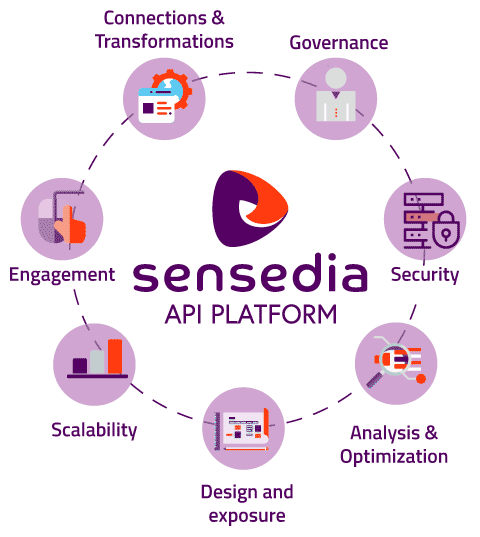

<!-- TOC -->

- [Português](#português)
  - [Ambientes Híbridos do API-Platform](#ambientes-híbridos-do-api-platform)
  - [Necessidade](#necessidade)
  - [Composição](#composição)
  - [Instalação](#instalação)
- [English](#english)
  - [Hybrid Environments](#hybrid-environments)
  - [Need](#need)
  - [Composition](#composition)
  - [Installation](#installation)
- [Español](#español)
  - [Entornos Híbridos de API-Platform](#entornos-híbridos-de-api-platform)
  - [Necesitar](#necesitar)
  - [Composición](#composición)
  - [Instalación](#instalación)

<!-- TOC -->

 

    
 

# Português

**API-Platform**: plataforma de gerenciamento de APIs. Acelere suas estratégias digitais com integrações e gerenciamento de APIs. Saiba em: https://sensedia.com.

## Ambientes Híbridos do API-Platform

Ambientes híbridos do API-Platform são ambientes onde apenas uma parte dos componentes da solução operam remotamente (no cliente), diferente do que acontece em ambientes cloud (gerenciados pela Sensedia).

## Necessidade

O ambiente híbrido é necessário quando o cliente deseja realizar operações de APIs, internamente em sua própria infraestrutura.

Nesse caso, existe a possibilidade de que alguns componentes da topologia do API-Platform operem remotamente, mas ainda assim mantenham comunicação com os módulos core na cloud.

## Composição

Atualmente, o ambiente híbrido é composto pelos seguintes componentes:

| Módulo | Descrição |
|:---|:---|
| **Redis** | Utilizado para armazenamento de cenários e tokens na plataforma. É um componente que deverá ser fornecido preferencialmente pelos clientes. |
| **Agent Authorization** | Esse módulo se conecta com o ambiente cloud e é responsável pelas telemetria dos tokens gerados no ambiente do cliente. |
| **Agent Gateway** | Esse módulo se conecta com o ambiente cloud e é responsável por receber todas as atualizações de cenários de APIs. |
| **Logstash Federated** | Faz o envio massivo do trace gerado no ambiente do cliente. |
| **API Authorization** | Responsável pela geração de tokens de autorização nas APIs. |
| **API Gateway** | Recebe as requisições de APIs e realiza as operações necessárias. |

## Instalação

A instalação pode ser realizada utilizando as seguintes tecnologias:

* [Docker Compose](compose/README.md).
* [Kubernetes + Helm](kubernetes/README.md).

# English

**API-Platform**: API management platform. Accelerate your digital strategies with integrations and API Management. Learn more at: https://sensedia.com

## Hybrid Environments

Hybrid environments are environments where only a part of the solution components operate remotely (on the client), differently from what happens in cloud environments (managed by Sensedia).

## Need

The hybrid environment is necessary when the customer wants to perform API operations internally, in their own infrastructure.

In this case, there is a possibility that some components of the API-Platform topology operate remotely, but still maintain communication with the core modules on the cloud.

## Composition

Currently, the hybrid environment consists of the following components:

| Module | Description |
|:---|:---|
| **Redis** | Used to store scenarios and tokens on the platform. It is a component that should be provided preferably by customers. |
| **Agent Authorization** | This module connects with the environment cloud and is responsible for the telemetry of the tokens generated in the client environment |
| **Agent Gateway** | This module connects with the environment cloud and is responsible for receiving all updates to API scenarios |
| **Logstash Federated** | Massively sends the trace generated in the client environment |
| **API Authorization** | Responsible for generating authorization tokens in the APIs |
| **API Gateway** | Receives API requests and performs necessary operations |

## Installation

The installation can be performed using the following technologies:

* [Docker Compose](compose/README_en.md).
* [Kubernetes + Helm](kubernetes/README_en.md).

# Español

**API-Platform**: plataforma de administración de APIs. Acelere sus estrategias digitales con integraciones y API Management. Obtenga más informaciónes en: https://sensedia.com.

## Entornos Híbridos de API-Platform

Los entornos híbridos de API-Platform son entornos en los que solo una parte de los componentes de la solución funcionan de forma remota (en el cliente), a diferencia de lo que sucede en entornos de nube (administrados por Sensedia).

## Necesidad

El entorno híbrido es necesario cuando el cliente desea realizar operaciones de APIs internamente, en su propia infraestructura.

En este caso, existe la posibilidad de que algunos componentes de la topología de la API-Platform operen de forma remota, pero aún mantengan comunicación con los módulos principales en la nube.

## Composición

Actualmente, el entorno híbrido consta de los siguientes componentes:

| Módulo | Descripción |
|:---|:---|
| **Redis** | Se usa para almacenar escenarios y tokens en la plataforma. Es un componente que debe ser proporcionado preferentemente por los clientes. |
| **Agent Authorization** | Este módulo se conecta con el entorno de la nube y es responsable de la telemetría de los tokens generados en el entorno del cliente. |
| **Agent Gateway** | Este módulo se conecta con el entorno de la nube y es responsable de recibir todas las actualizaciones de los escenarios API.
| **Logstash Federated** | Envía masivamente la traza generada en el entorno del cliente. |
| **API Authorization** | Responsable de generar tokens de autorización en las APIs.
| **API Gateway** | Recibe peticiones de APIs y realiza las operaciones necesarias. |

## Instalación

La instalación se puede realizar utilizando las siguientes tecnologías:

* [Docker Compose](compose/README_es.md).
* [Kubernetes + Helm](kubernetes/README_es.md).
