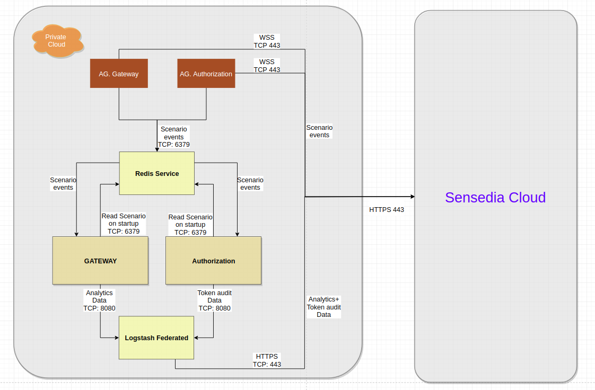
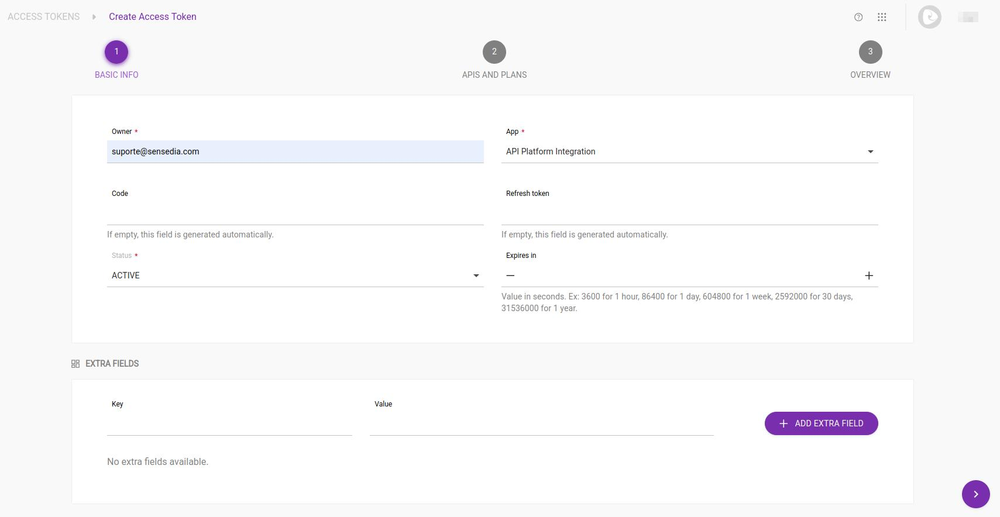
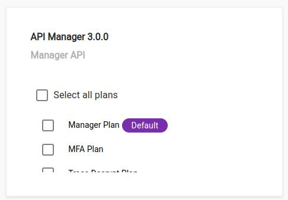
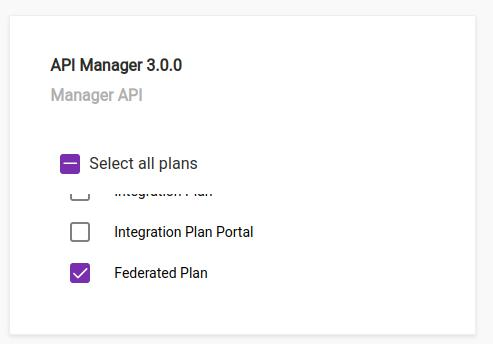
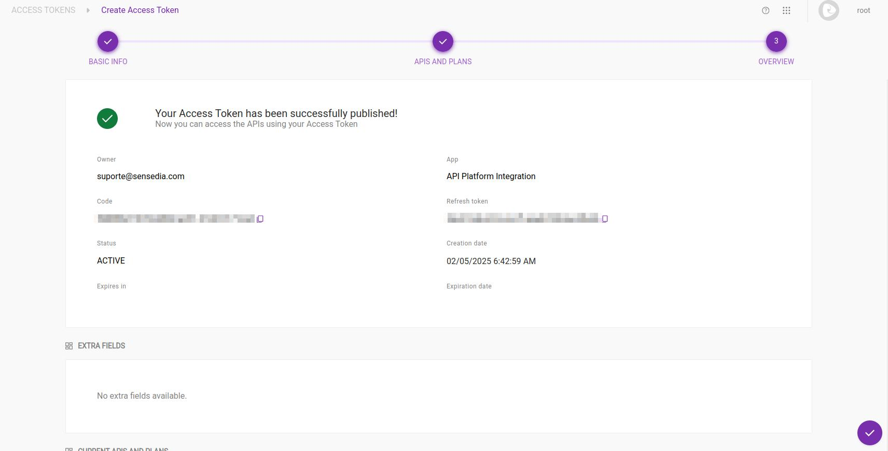
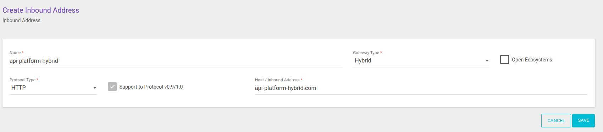
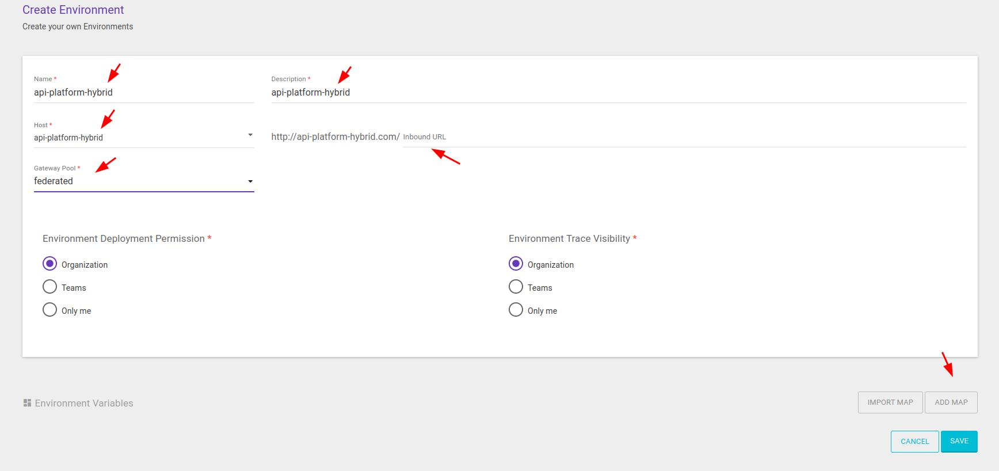
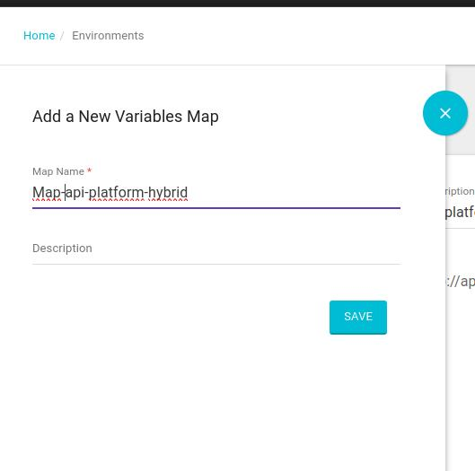
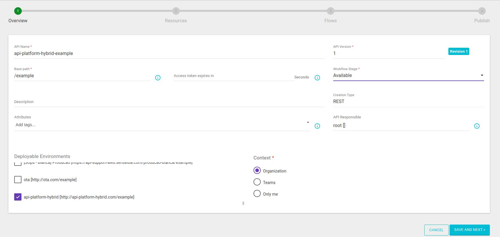

<!-- TOC -->

- [API-Platform Híbrido - Kubernetes](#api-platform-híbrido---kubernetes)
- [Módulos para Ambiente Híbrido](#módulos-para-ambiente-híbrido)
- [Modelos de Deployment Suportados](#modelos-de-deployment-suportados)
- [Topologia Macro](#topologia-macro)
- [Recursos Recomendados](#recursos-recomendados)
- [Requisitos de Instalação](#requisitos-de-instalação)
  - [Criação do Customer ID](#criação-do-customer-id)
  - [Criação de Token](#criação-de-token)
  - [Redis](#redis)
    - [AWS ElastiCache](#aws-elasticache)
    - [GCP Memorystore](#gcp-memorystore)
    - [Instalação do Redis com Docker Compose](#instalação-do-redis-com-docker-compose)
  - [Instalação do Kubectl](#instalação-do-kubectl)
  - [Instalação do Helm](#instalação-do-helm)
    - [Download do Helm](#download-do-helm)
    - [Repositório de Helm Charts da Sensedia](#repositório-de-helm-charts-da-sensedia)
  - [Criação de Namespace no Cluster Kubernetes](#criação-de-namespace-no-cluster-kubernetes)
- [Comandos Úteis](#comandos-úteis)
- [Instalação dos Módulos do API-Platform](#instalação-dos-módulos-do-api-platform)
  - [Alterando a Versão dos Módulos e Outros Parâmetros](#alterando-a-versão-dos-módulos-e-outros-parâmetros)
  - [Instalação do Agent Authorization](#instalação-do-agent-authorization)
  - [Instalação do Agent Gateway](#instalação-do-agent-gateway)
  - [Instalação do Logstash-Federated](#instalação-do-logstash-federated)
  - [Instalação do API-Authorization](#instalação-do-api-authorization)
  - [Instalação do API-Gateway](#instalação-do-api-gateway)
- [Ativação de Ambiente Híbrido](#ativação-de-ambiente-híbrido)

<!-- TOC -->

# API-Platform Híbrido - Kubernetes

O modelo de deploy Híbrido é recomendado para clientes que têm preocupação com latência. Esta documentação explica como realizar o deployment dos módulos/serviços utilizados no ambiente híbrido usando [Kubernetes](https://kubernetes.io) e [Helm](https://helm.sh).

O ambiente híbrido é composto por módulos desenvolvidos pela Sensedia e componentes de infraestrutura.

Os componentes de infraestrutura, bem como sua operação e sustentação, são de responsabilidade do cliente. Por essa razão, a infraestrutura, bem como a equipe responsável, deve ser capaz de prover soluções para:

* Ingress/egress
* Load balancing
* Backup
* Monitoramento

Tabela 1: Serviços executados/mantidos pelo cliente no ambiente híbrido.

| **Recurso** | **Opções** | **Detalhes** |
| --- | --- | --- |
| Ingress/Load Balancer | HTTP/HTTPS load balancer (_exemplo: ALB / F5 / NGINX / Traefik etc_). | Os certificados devem ser aplicados na camada de balanceamento. |
| Backup | Qualquer solução que efetue cópia do arquivo de retenção de dados do Redis (_\*.rdb_) para armazenamento (_seguro_) externo. | Este arquivo precisa ser protegido por conter informações sensíveis (_exemplo: access token_). |
| Monitoramento | Qualquer solução de monitoramento que suporte health check HTTP. | Todos os módulos híbridos expõem métricas através do endpoint ``metrics``. A única exceção é o Gateway, que expõe métricas pelo endpoint ``/gateway-admin/metrics``. |

# Módulos para Ambiente Híbrido

Tabela 2: Descrição de requisito de Ingress, LB e Backup por módulo.

| **Módulo** | **Descrição** | **Necessário load balancer?** | **Necessário backup?** |
| --- | --- | --- | --- |
| Agent-authorization | Transferência de Cenário entre Cloud Sensedia e Authorization Híbrido. | Não | Não |
| Agent-gateway | Transferência de Cenário entre Cloud Sensedia e Gateway Híbrido. | Não | Não |
| Gateway | Responsável por processar as mensagens. | Sim | Não |
| Authorization | Responsável pela geração de Tokens. | Sim | Não |
| Logstash-federated | Transferência de Dados analíticos e auditoria de tokens para Cloud Sensedia. | Opcional | Não |
| Redis | Grid de memória para compartilhamento de informações entre os módulos. | Não | Sim (normalmente do \*.rdb) |

# Modelos de Deployment Suportados

Tabela 3: Opções de provisionamento por módulo.

| **Módulo** | **Kubernetes** | **Docker** | **VM (Centos / Red Hat 7)** | **Serviços Gerenciados** |
| --- | --- | --- | --- | --- |
| Agent-authorization | Sim | Sim | Sim (sobre docker-compose) | n/a |
| Agent-gateway | Sim | Sim | Sim (sobre docker-compose) | n/a |
| Gateway | Sim | Sim | Sim (sobre docker-compose) | n/a |
| Authorization | Sim | Sim | Sim (sobre docker-compose) | n/a |
| Logstash-federated | Sim | Sim | Sim (sobre docker-compose) | n/a |
| Redis (>= 4.0.11) | Livre escolha ||| - ElastiCache (AWS) <br> - Memorystore (GCP) |
| Ingress | Sim (service/ingress) | Sim (load balancer do Cliente) | Sim (load balancer do Cliente) | - ELB / ALB (AWS) <br> - Compute Load Balancer (GCP) |

# Topologia Macro

Figura 1: Representação dos módulos e conexões do Modelo Híbrido.



# Recursos Recomendados

Cada aplicação deve ser provisionada considerando os recursos de hardware dos nodes do cluster Kubernetes e o monitoramento diário das métricas de CPU, memória dos pods e a quantidade de requisições por segundo.

    ATENÇÃO!!! A tabela a seguir expressa apenas uma sugestão inicial e considera apenas o consumo de recursos mínimos por uma única réplica do pod que executa cada aplicação.

    Essa tabela não representa a especificação de hardware dos nodes, apenas a especificação dos pods de cada aplicação e deve ser alterada por cada cliente de acordo com a demanda por recursos de hardware e de acordo com a demanda para utilização dos serviços, a ser observada com o uso e monitoramento diário.

|Módulos|CPU|Memória RAM|Disco|
|-|-|-|-|
|Agent Gateway|1|2 GB|60 GB|
|Agent Authorization|1|2 GB|60 GB|
|API Gateway|1|2 GB|60 GB|
|API Authorization|1|2 GB|60 GB|
|Logstash Federated|1|1 GB|100 GB|
|Redis Data Node|2|4 GB|60 GB|

# Requisitos de Instalação

Nas seções seguintes são apresentados os requisitos de instalação do API-Platform no ambiente híbrido.

## Criação do Customer ID

O ``customerid`` é a identificação única de cada cliente e é gerado pela Sensedia.

Obtenha o ``customerid`` junto ao time de suporte. Você precisará dessa informação para usar durante a realização de ajustes na configuração de parâmetros do helm chart de alguns módulos do API-Platform.

Exemplo de uso do ``customerid`` em um arquivo de configuração:

```
customerId: "CHANGE_HERE"
```

## Criação de Token

A configuração do ambiente híbrido tem como pré-requisito a utilização de um token da plataforma. O token deve ser criado utilizando o seguinte procedimento:

* Acesse o API-Manager.
* Clique no menu da página de **Access Token**.
* Clique no botão **Create Access token**.
* O campo **Owner** deve conter o email de um usuário responsável pelo ambiente.
* Defina o valor **API Platform Integration** no campo **App**.



* Na próxima página, selecione a API **API Manager 3.0.0**.



* Selecione o plano **Federated Plan**.



* Clique no botão **Save Plan**.
* Na próxima página, publique o token por meio do botão **Publish your access token**.



* Salve o token gerado e armazene em algum arquivo, pois você precisará dele para customizar alguns parâmetros de configuração de alguns módulos do API-Platform.

## Redis

Módulo responsável pelo armazenamento de access token e cenários de APIs. O deploy do Cluster Redis pode ser efetuado através de Serviços Gerenciados, tais como: AWS ElastiCache e GCP Memorystore. Há também a opção de instalar o Redis usando o Docker Compose mostrado nesta [documentação](../compose/redis-cluster/README.md).

### AWS ElastiCache

O API-Platform é compatível com o ElastiCache (serviço gerenciado do Redis na AWS). Esse guia é apenas uma orientação básica sobre o deployment do ElastiCache. Para obter o suporte oficial é recomendada a leitura da documentação oficial do serviço: https://aws.amazon.com/elasticache.

* Acesse o console do ElastiCache (https://console.aws.amazon.com/elasticache).
* Clique em **Create** para iniciar o assistente **Cache Cluster**.
* Siga as instruções apresentadas na tela e defina as preferências de **VPC** e **Security group**.
* As opções padrão são suficientes para o uso do API-Platform.
* O número de nodes varia conforme o workload esperado para o ambiente. Recomendamos, salvo haja expectativa de alto workload já no primeiro momento, iniciar com 6 nodes no modo **cluster**, monitorá-lo e escalá-lo conforme a demanda.

O resultado do processo de instalação deverá ser o **configuration endpoint** do ElastiCache, que será utilizado durante os ajustes nos parâmetros de configuração de alguns módulos do API-Platform.

### GCP Memorystore

O API-Platform é compatível com o Memorystore (serviço gerenciado do Redis na GCP). Esse guia é apenas uma orientação básica sobre o deployment do Memorystore. Para obter o suporte oficial é recomendada a leitura da documentação oficial do serviço: https://console.cloud.google.com/memorystore/instances.

* Crie um memorystore no modo **cluster**.
* O número de nodes varia conforme o workload esperado para o ambiente.
* As opções padrão são suficientes para o uso do API-Platform.
* Recomendamos, salvo haja expectativa de alto workload já no primeiro momento, iniciar com redundância, monitorá-lo e escalá-lo conforme a demanda.

### Instalação do Redis com Docker Compose

Como objetivo de facilitar a instalação, a Sensedia provê uma documentação sobre a instalação do Redis em ambientes on-premises usando o Docker Compose. É recomendado, porém, que o responsável pela instalação tenha entendimento da tecnologia e observe cada passo. Acesse a documentação [aqui](../compose/redis-cluster/README.md).

## Instalação do Kubectl

Kubectl é o um utilitário de linha de comando utilizado para administrar clusters Kubernetes.

Execute os seguintes comandos para instalar o ``kubectl`` no GNU/Linux.

```bash
curl -LO https://storage.googleapis.com/kubernetes-release/release/$(curl -s https://storage.googleapis.com/kubernetes-release/release/stable.txt)/bin/linux/amd64/kubectl

chmod +x kubectl

sudo mv kubectl /usr/local/bin/kubectl

kubectl version --client
```

Obtenha mais informações sobre o ``kubectl`` na página: https://kubernetes.io/docs/reference/kubectl/overview/.


## Instalação do Helm

A instalação do API-Platform é realizada por meio de pacotes Helm, também conhecidos como **Helm charts** ou simplesmente **charts**.

Helm é o gerenciador de pacotes do Kubernetes. Assim como um gerenciador de pacotes do sistema operacional facilita a instalação de aplicativos e ferramentas, o Helm facilita a instalação de aplicativos e recursos nos clusters do Kubernetes.

### Download do Helm

Execute os seguintes comandos para instalar o **Helm 3** no GNU/Linux.

```bash
wget https://get.helm.sh/helm-v3.2.4-linux-amd64.tar.gz

tar -zxvf helm-v3.2.4-linux-amd64.tar.gz

sudo cp linux-amd64/helm /usr/bin/

sudo chmod +x /usr/bin/helm

helm version
```

Para o comando a seguir funcionar corretamente, será necessário que o ``kubectl`` esteja configurado e conectado a um cluster Kubernetes.

```bash
helm ls
```

### Repositório de Helm Charts da Sensedia

Adicione o repositório de Helm charts estáveis da Sensedia disponível na AWS-S3.

```bash
helm repo add sensedia-helm-s3 http://sensedia-helm-charts-s3.s3.amazonaws.com
```

Atualize a lista de charts disponíveis para instalação.

```bash
helm repo update
```

Liste todas as versões de Helm charts disponíveis para instalação. Observe o nome do chart na coluna **NAME** e a versão na coluna **CHART_VERSION**. Pode ignorar a informação contida na coluna **APP VERSION**, porque optamos por não indexar a versão de cada módulo do API-Platform nessa coluna e indexar apenas na imagem Docker informada dentro do arquivo ``*.yaml`` de cada chart.

```bash
helm search repo sensedia-helm-s3 -l
```

Inicialmente, as versões de chart utilizadas neste documento são citadas a seguir. Mas com a evolução do produto ao longo do tempo, novas versões de chart serão disponibilizadas e recomendamos o uso das versões mais novas. Qualquer dúvida, entre em contato com o time de suporte da Sensedia.

* agent-authorization - 1.0.1 ou superior
* agent-gateway - 1.0.1 ou superior
* logstash-federated - 1.0.2 ou superior
* api-authorization - 1.0.0 ou superior
* api-gateway - 1.0.3 ou superior

## Criação de Namespace no Cluster Kubernetes

É recomendado fazer a instalação dos módulos da plataforma em um namespace específico, de forma a segregar os recursos do API-Platform do restante das aplicações no cluster.

Use os seguintes comandos para a criar um namespace e listar os namespaces criados no cluster Kubernetes.

> Observação: Para os comandos a seguir funcionarem corretamente, será necessário que o kubectl esteja configurado e conectado a um cluster Kubernetes. Você também pode substituir o termo ``MY_HYBRID_ENV`` por outro nome de namespace e utilizar em todos os comandos mostrados ao longo desta documentação.

```bash
kubectl create namespace MY_HYBRID_ENV

kubectl get namespaces
```

Exemplos de nomes de namespace:

* datacenter-sp1-gateways
* datacenter-sp2-gateways
* datacenter-rj1-gateways

# Comandos Úteis

Durante a instalação dos módulos da plataforma, é possível listar os objetos criados, bem como seus respectivos logs. Os comandos a seguir podem ser utilizados para essa finalidade.

Execute o seguinte comando para listar o ``id`` de cada pod de um namespace.

```bash
kubectl get pods -n MY_HYBRID_ENV
```

Execute o seguinte comando para visualizar o log de um pod de um namespace.

```bash
kubectl logs -f POD_ID -n MY_HYBRID_ENV
```

# Instalação dos Módulos do API-Platform

As seções a seguir apresentam as informações de instalação dos módulos do API-Platform para ambientes híbridos.

## Alterando a Versão dos Módulos e Outros Parâmetros

> Observação: Use as explicações desta seção e o exemplo como base para alterar a versão de um ou mais módulos da plataforma e customizar os demais parâmetros conforme a necessidade de cada ambiente.

À medida que o desenvolvimento da plataforma evolui e de acordo com as necessidades do ambiente híbrido de cada cliente, pode ser necessário customizar alguns parâmetros antes de fazer o deploy.

Em cada arquivo no formato .yaml que for criado nas seções seguintes haverá um conjunto de opções que podem ser customizadas.

A seguir é mostrado o exemplo de um arquivo .yaml para deploy de um módulo e explicado que valores podem ser customizados.

Exemplo 1: Conteúdo do arquivo ``values.yaml`` do módulo **Agent Authorization**.

```yaml
# Default values for agent-authorization.
# This is a YAML-formatted file.
# Declare variables to be passed into your templates.
replicaCount: 1
image:
  repository: gcr.io/production-main-268117/agent-authorization
  tag: "CHANGE_HERE"
  pullPolicy: IfNotPresent
service:
  type: ClusterIP
  port: 80
properties:
  javaOpts: "-Djava.security.egd=file:/dev/./urandom -Dfile.encoding=UTF8 -Dlog4j2.formatMsgNoLookups=True -Xms1536m -Xmx1536m -XX:ParallelGCThreads=1 -XX:ConcGCThreads=1 -Djava.util.concurrent.ForkJoinPool.common.parallelism=1 -XX:CICompilerCount=2 -XX:+UseParallelGC -XX:GCTimeRatio=4 -XX:AdaptiveSizePolicyWeight=90 -XX:MinHeapFreeRatio=20 -XX:MaxHeapFreeRatio=40 -XX:+ExitOnOutOfMemoryError"
  redis:
    connectionType: "CHANGE_HERE" #Up to you. Are you using CLUSTER or MASTER_SLAVE?
    address: "CHANGE_HERE" #Example: x.x.x.x:6379
    password: "CHANGE_HERE" #Password base64
  logLevel: INFO
  trackExpires: 7
  #--- IF client in AWS
  websocketUri: wss://integration-aws.sensedia.com/websocket
  #--- If client in GCP
  #websocketUri: wss://integration-production-gcp.sensedia.com/websocket
  customerId: "CHANGE_HERE"
  sensediaAuth: "CHANGE_HERE"
autoscaling:
  enabled: false
  minReplicas: 1
  maxReplicas: 1
  averageUtilization: 70
ingress:
  enabled: false
  annotations: {}
  hosts:
    - host: chart-example.local
      paths: []
  tls: []
resources:
  limits:
    cpu: "1"
    memory: 2Gi
  requests:
    cpu: 600m
    memory: 640Mi
```

Altere os valores definidos como ``CHANGE_HERE`` para os valores condizentes com seu ambiente híbrido.

Explicação do conteúdo do arquivo ``values.yaml`` do módulo **Agent Authorization**.

* Na **linha 1** é definida a quantidade de réplicas do pod, que executam o módulo e que podem ser executadas no cluster Kubernetes. Altere o valor conforme a demanda e disponibilidade de recursos de CPU, memória e endereços IP.
* A **linha 4** contém o endereço do Docker Registry e o nome da imagem Docker do respectivo módulo (``gcr.io/production-main-268117/agent-authorization``). Você deve entrar em contato com o time da Sensedia para saber qual a URL do Docker Registry, nome da imagem docker do módulo que deve utilizar e alterar no arquivo ``.yaml`` antes de fazer o deploy.
* A **linha 5** contém a versão do módulo (``1909.1.1.2``). Você deve entrar em contato com o time da Sensedia para saber qual a versão que deve utilizar e alterar no arquivo ``.yaml`` antes de fazer o deploy.
* Das **linhas 14 a 17**, encontramos as informações referentes ao redis. Nesta sessão do yaml, é preciso alterar as informações de endereçamento do redis e caso necessário, aplicar uma senha de acesso. Tal senha precisa ser codificada em base64. 
* As **linhas 23 a 27** contém a definição de autoscaling para o pod. Altere conforme a demanda e a disponibilidade de recursos de hardware no cluster e de endereços IP.
* As **linhas 29 a 35** contém a definição de ingress e TLS para o módulo. Altere conforme a necessidade do ambiente.
* As **linhas 37 a 43** contém a definição dos limites de uso dos recursos de CPU e memória a serem utilizados por cada pod do módulo. Altere conforme a demanda e a disponibilidade de recursos de hardware no cluster.

## Instalação do Logstash-Federated

O arquivo contendo exemplos de parâmetros de configuração para o módulo **Logstash-Federated** está disponível [aqui](helm/values_examples/logstash-federated/values.yaml).

Crie uma cópia do arquivo ``values.yaml`` de exemplo para o arquivo ``api-platform-hybrid/logstash-federated.yaml``.

```bash
cp api-platform-hybrid/kubernetes/helm/values_examples/logstash-federated/values.yaml ~/api-platform-hybrid/logstash-federated.yaml
```

Altere os valores dos parâmetros do arquivo ``api-platform-hybrid/logstash-federated.yaml`` conforme as instruções da seção **Alterando a Versão dos Módulos e Outros Parâmetros**.

Use o seguinte comando para obter a versão do Helm chart do **Logstash-Federated**.

```bash
helm search repo sensedia-helm-s3/logstash-federated -l
```

Use o seguinte comando para fazer o deploy do **Logstash-Federated**.

> Observação: Altere o termo ``VERSION`` pelo número da versão do Helm chart, conforme mostrado na seção **Repositório de Helm Charts da Sensedia**.

```bash
helm upgrade --install logstash-federated sensedia-helm-s3/logstash-federated --version VERSION --namespace MY_HYBRID_ENV --values ~/api-platform-hybrid/logstash-federated.yaml
```

## Instalação do Agent Authorization

O arquivo contendo exemplos de parâmetros de configuração para o módulo **Agent Authorization** está disponível [aqui](helm/values_examples/agent-authorization/values.yaml).

Acesse o seu diretório ``/home``. Crie o diretório ``api-platform-hybrid``.

```bash
cd ~

mkdir api-platform-hybrid
```

Crie uma cópia do arquivo ``values.yaml`` de exemplo para o arquivo ``api-platform-hybrid/agent-authorization.yaml``.

```bash
cp api-platform-hybrid/kubernetes/helm/values_examples/agent-authorization/values.yaml ~/api-platform-hybrid/agent-authorization.yaml
```

Altere os valores dos parâmetros do arquivo ``api-platform-hybrid/agent-authorization.yaml`` conforme as instruções da seção **Alterando a Versão dos Módulos e Outros Parâmetros**.

Use o seguinte comando para obter a versão do Helm chart do **Agent Authorization**.

```bash
helm search repo sensedia-helm-s3/agent-authorization -l
```

Use o seguinte comando para fazer o deploy do **Agent Authorization**.

> Observação: Altere o termo ``VERSION`` pelo número da versão do Helm chart, conforme mostrado na seção **Repositório de Helm Charts da Sensedia**.

```bash
helm upgrade --install agent-authorization sensedia-helm-s3/agent-authorization --version VERSION --namespace MY_HYBRID_ENV --values ~/api-platform-hybrid/agent-authorization.yaml
```

## Instalação do Agent Gateway

O arquivo contendo exemplos de parâmetros de configuração para o módulo **Agent Gateway** está disponível [aqui](helm/values_examples/agent-gateway/values.yaml).

Crie uma cópia do arquivo ``values.yaml`` de exemplo para o arquivo ``api-platform-hybrid/agent-gateway.yaml``.

```bash
cp api-platform-hybrid/kubernetes/helm/values_examples/agent-gateway/values.yaml ~/api-platform-hybrid/agent-gateway.yaml
```

Altere os valores dos parâmetros do arquivo ``api-platform-hybrid/agent-gateway.yaml`` conforme as instruções da seção **Alterando a Versão dos Módulos e Outros Parâmetros**.

Conforme mencionado anteriormente no Agent-Authorization, é possível configurar uma senha de acesso ao redis em base64 caso necessário. 

Use o seguinte comando para obter a versão do Helm chart do **Agent Gateway**.

```bash
helm search repo sensedia-helm-s3/agent-gateway -l
```

Use o seguinte comando para fazer o deploy do **Agent Gateway**.

> Observação: Altere o termo ``VERSION`` pelo número da versão do Helm chart, conforme mostrado na seção **Repositório de Helm Charts da Sensedia**.

```bash
helm upgrade --install agent-gateway sensedia-helm-s3/agent-gateway --version VERSION --namespace MY_HYBRID_ENV --values ~/api-platform-hybrid/agent-gateway.yaml
```

## Instalação do API-Authorization

O arquivo contendo exemplos de parâmetros de configuração para o módulo **API Authorization** está disponível [aqui](helm/values_examples/api-authorization/values.yaml).

Crie uma cópia do arquivo ``values.yaml`` de exemplo para o arquivo ``api-platform-hybrid/api-authorization.yaml``.

```bash
cp api-platform-hybrid/kubernetes/helm/values_examples/api-authorization/values.yaml ~/api-platform-hybrid/api-authorization.yaml
```

Altere os valores dos parâmetros do arquivo ``api-platform-hybrid/api-authorization.yaml`` conforme as instruções da seção **Alterando a Versão dos Módulos e Outros Parâmetros**.

Use o seguinte comando para obter a versão do Helm chart do  **API Authorization**.

```bash
helm search repo sensedia-helm-s3/api-authorization -l
```

Use o seguinte comando para fazer o deploy do **API Authorization**.

> Observação: Altere o termo ``VERSION`` pelo número da versão do Helm chart, conforme mostrado na seção **Repositório de Helm Charts da Sensedia**.

```bash
helm upgrade --install api-authorization sensedia-helm-s3/api-authorization --version VERSION --namespace MY_HYBRID_ENV --values ~/api-platform-hybrid/api-authorization.yaml
```

## Instalação do API-Gateway

O arquivo contendo exemplos de parâmetros de configuração para o módulo **API Gateway** está disponível [aqui](helm/values_examples/api-gateway/values.yaml).

Crie uma cópia do arquivo ``values.yaml`` de exemplo para o arquivo ``api-platform-hybrid/api-gateway.yaml``.

```bash
cp api-platform-hybrid/kubernetes/helm/values_examples/api-gateway/values.yaml ~/api-platform-hybrid/api-gateway.yaml
```

Altere os valores dos parâmetros do arquivo ``api-platform-hybrid/api-gateway.yaml`` conforme as instruções da seção **Alterando a Versão dos Módulos e Outros Parâmetros**.

> Observação: A propriedade ``apigateway_label`` deve ser preenchida com o nome desejado para o Gateway Pool e informada posteriormente através de abertura de chamado ou ticket para que a equipe de **Suporte e Operações** possa concluir o cadastro.

Use o seguinte comando para obter a versão do Helm chart do **API Gateway**.

```bash
helm search repo sensedia-helm-s3/api-gateway -l
```

Use o seguinte comando para fazer o deploy do **API Gateway**.

> Observação: Altere o termo ``VERSION`` pelo número da versão do Helm chart, conforme mostrado na seção **Repositório de Helm Charts da Sensedia**.

```bash
helm upgrade --install api-gateway sensedia-helm-s3/api-gateway --version VERSION --namespace MY_HYBRID_ENV --values ~/api-platform-hybrid/api-gateway.yaml
```

Liste os pods do seu namespace para verificar se todos os módulos estão instalados.

```bash
kubectl get pods -n MY_HYBRID_ENV
```

> Observação: Os pods do **api-gateway** não ficarão *healthy* até que o passo [Ativação de Ambiente Híbrido](#ativação-de-ambiente-híbrido) seja concluído.

# Ativação de Ambiente Híbrido

A instalação do ambiente é baseado em Gateway Pools. Esses pools representam um grupo de gateways que pode ser usado por um ou mais environments virtuais.

> Observação: Apenas a criação do Gateway Pool é efetuada pela equipe de **Suporte e Operações** da Sensedia através da abertura de chamado ou ticket.
* Adicione um Inbound Address acesse o **API-Manager** e clique no menu **VirtualHosts** e apos em Inbound Address
* Crie um novo **Inbound Address** e preencha os campos:
  * Name;
  * Gateway Type;
  * Protocol Type;
  * Host /Inbound Address;
* Clique em **Save**.



* Para ativar um ambiente híbrido, acesse o **API-Manager** e clique no menu **Environments**.
* Crie um novo **Environment** e preencha os campos:
  * Name;
  * Inbound URL;
  * Description;
  * Gateway Pool (neste campo você deve indicar o Gateway Pool que foi informado pela equipe da Sensedia via ticket).
* Clique em **Add Map**.



* Crie um Map para definir a variável de **Destination do Authorization**, o valor será o endpoint do **Authorization** criado durante a instalação dos módulos híbridos do API-Platform.



* Acesse o menu **APIs**.
* Selecione/Crie a API que deseja que seja utilizada por esse Gateway Pool.
* Adicione o **Environment Federado** na API selecionada/criada.
* Efetue o deploy do **Environment Federado**.



* Efetue o teste de validação de sua API fazendo uma requisição no Gateway Híbrido.


