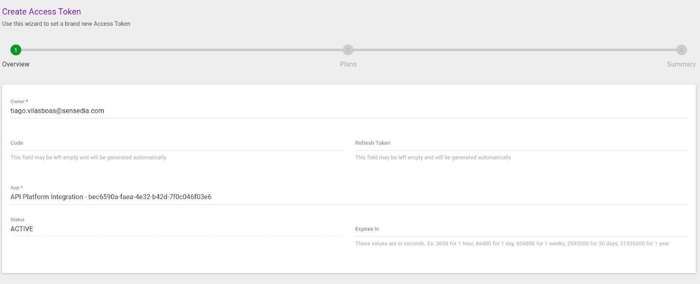
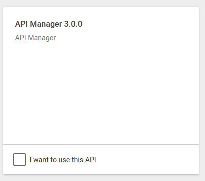
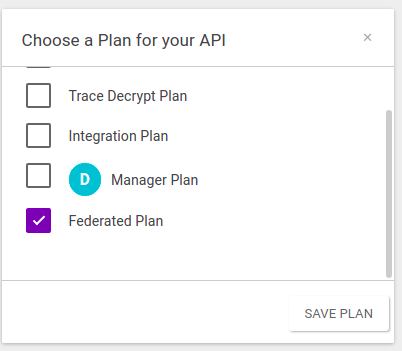
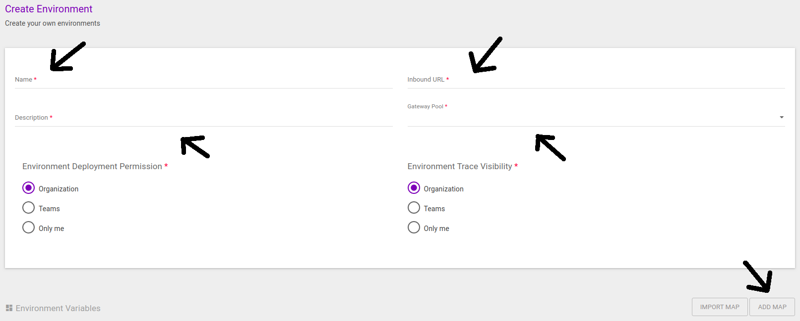
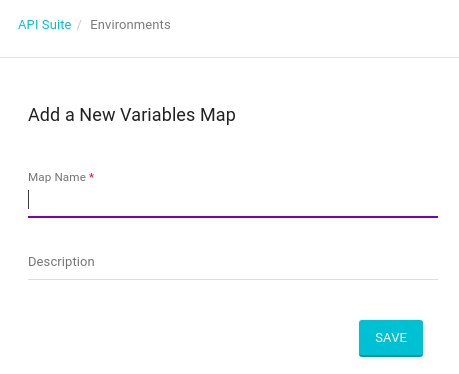
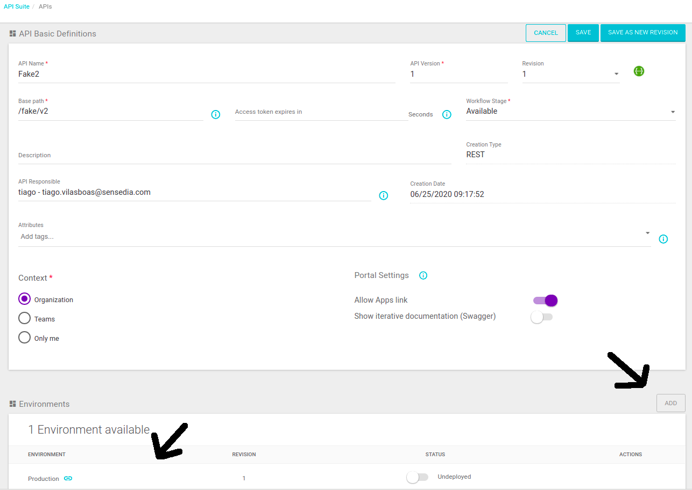

<!-- TOC -->

- [Hybrid API-Platform - Kubernetes](#hybrid-api-platform---kubernetes)
- [Hybrid Environment Modules](#hybrid-environment-modules)
- [Supported Deployment Modelos](#supported-deployment-modelos)
- [Macro Topology](#macro-topology)
- [Recommended Resources](#recommended-resources)
- [Installation Requirements](#installation-requirements)
  - [Customer ID creation](#customer-id-creation)
  - [Token creation](#token-creation)
  - [Redis](#redis)
    - [AWS ElastiCache](#aws-elasticache)
    - [GCP Memorystore](#gcp-memorystore)
    - [Installing Redis with Docker Compose](#installing-redis-with-docker-compose)
  - [Installing Kubectl](#installing-kubectl)
  - [Installing Helm](#installing-helm)
    - [Downloading Helm](#downloading-helm)
    - [Sensedia Helm Charts Repository](#sensedia-helm-charts-repository)
  - [Creation of Namespace on the Kubernetes Cluster](#creation-of-namespace-on-the-kubernetes-cluster)
- [Useful Commands](#useful-commands)
- [Installation of the API-Platform Modules](#installation-of-the-api-platform-modules)
  - [Changing Modules Versions and Other Parameters](#changing-modules-versions-and-other-parameters)
  - [Installing Agent Authorization](#installing-agent-authorization)
  - [Installing Agent Gateway](#installing-agent-gateway)
  - [Installing Logstash-Federated](#installing-logstash-federated)
  - [Installing API-Authorization](#installing-api-authorization)
  - [Installing API-Gateway](#installing-api-gateway)
- [Hybrid Environment Activation](#hybrid-environment-activation)

<!-- TOC -->


# Hybrid API-Platform - Kubernetes

We recommend the hybrid deployment method for clients concerned about latency. This documentation explains how to deploy the modules/services used on the hybrid environment using [Kubernetes](https://kubernetes.io) and [Helm](https://helm.sh).

The hybrid environment comprises modules developed by Sensedia and infrastructure components.

Infrastructure components, as well as their operation and support, are the client's responsibility. Thus, the infrastructure, as well as the responsible team, must be capable of providing:

* Ingress/egress
* Load balancing
* Backup
* Monitoramento

Table 1. Services executed/maintained by the Client on the Hybrid Environment

| **Resource** | **Options** | **Details** |
| --- | --- | --- |
| Ingress/Load Balancer | HTTP/HTTPS load balancer (_example: ALB / F5 / NGINX / Traefik etc_). | Certificates must be applied on the balancing layer. |
| Backup | Any solution that copies the Redis data retention file (_\*.rdb_) for (_safe_) external storage. | This file needs to be protected because it contains sensitive information (_example: access token_). |
| Monitoring | Any monitoring solution that supports HTTP health checks. | All hybrid modules expose metrics through the endpoint ``/metrics``. The only exception is the Gateway, which exposes metrics through the endpoint ``/gateway-admin/metrics``. |

# Hybrid Environment Modules

Table 2: Description of Ingress, LB and Backup requirements by module.

| **Module** | **Description** | **Is there a need for load balancing?** | **Is there a need for backup?** |
| --- | --- | --- | --- |
| Agent-authorization | Scenario transfer between Cloud Sensedia and Hybrid Authorization. | No | No |
| Agent-gateway | Scenario transfer between Cloud Sensedia and Hybrid Gateway. | No | No |
| Gateway | Responsible for processing messages. | Yes | No |
| Authorization | Responsible for token generation. | Yes | No |
| Logstash-federated | Transfer of analytical data and token audit for Cloud Sensedia. | Optional | No |
| Redis | Memory grid to share information across modules. | No | Yes (usually \*.rdb) |

# Supported Deployment Modelos

Table 3. Provisioning options by module.

| **Module** | **Kubernetes** | **Docker** | **VM (Centos / Red Hat 7)** | **Managed Services** |
| --- | --- | --- | --- | --- |
| Agent-authorization | Yes | Yes | Yes (on docker-compose) | n/a |
| Agent-gateway | Yes | Yes | Yes (on docker-compose) | n/a |
| Gateway | Yes | Yes | Yes (on docker-compose) | n/a |
| Authorization | Yes | Yes | Yes (on docker-compose) | n/a |
| Logstash-federated | Yes | Yes | Yes (on docker-compose) | n/a |
| Redis (>= 4.0.11) | Free choice ||| - ElastiCache (AWS) <br> - Memorystore (GCP) |
| Ingress | Yes (service/ingress) | Yes (Client's load balancer) | Yes (Client's load balancer) | - ELB / ALB (AWS) <br> - Compute Load Balancer (GCP) |

# Macro Topology

Figure 1. Representation of the modules and connections of the Hybrid Model.


# Recommended Resources

Each application must be provisioned considering the hardware resources of the Kubernetes cluster nodes and the daily monitoring of CPU metrics, pod memory and the number of requests per second.

    ATTENTION!!! The following table expresses only an initial suggestion and considers only the consumption of resources, by a single replica of the pod that runs each application.

    This table does not represent the specification of the hardware nodes, just a specification of the pods for each application and must be changed by each customer according to the demand for hardware resources and according to the demand for the use of services, one being observed with daily use and monitoring.

|Módulos|CPU|RAM Memory|Hard disk|
|-|-|-|-|
|Agent Gateway|1|2 GB|60 GB|
|Agent Authorization|1|2 GB|60 GB|
|API Gateway|1|2 GB|60 GB|
|API Authorization|1|2 GB|60 GB|
|Logstash Federated|1|1 GB|100 GB|
|Redis Data Node|2|4 GB|60 GB|

# Installation Requirements

The following sections present the installation requirements for API-Platform on a hybrid environment.

## Customer ID creation

``customerID`` is a unique identifier for each client and it's generated by Sensedia.

Obtain your ``customerid`` with the Support team. You will need it to fine tune the configuration of helm chart parameters for some API-Platform modules.

Example of ``customerid`` being set in a configuration file:

```
customerId: "CHANGE_HERE"
```

## Token creation

Using a Platform token is a requirement for configuring the hybrid environment. The token must be created following this procedure:

* Access the API Manager.
* Click the **Access Token** option on the main menu.
* Click the **Create access token** button.
* The field **Owner** must contain the email address of a user responsible for the environment.
* Define the **API Platform Integration** value on the field **App**.



* On the next page, select the API **API Manager 3.0.0**.



* Select the plan **Federated Plan**.



* Click the **Save Plan** button.
* On the next page, publish the token by clicking the button **Publish your access token**.


* Save the token and store it in a file, since you will use it to customise some configuration parameters of some API-Platform modules.

## Redis

Module responsible for storing access tokens and API scenarios. You can deploy the Redis Cluster through managed services, such as WS ElastiCache and GCP Memorystore. It's also possible to install Redis using Docker Compose, as shown in this [document](../compose/redis-cluster/README_en.md).

### AWS ElastiCache

API-Platform is compatible with ElastiCache (Redis managed service on AWS). This guide is simply a basic step-by-step on ElastiCache deployment. To obtain official support, we recommend reading the official documentation: https://aws.amazon.com/elasticache.

* Access the ElastiCache console (https://console.aws.amazon.com/elasticache).
* Click on **Create** to start the **Cache Cluster** assistant.
* Follow the instructions displayed on the screen and define your **VPC** and **Security group** preferences.
* The default options are enough for using the API-Platform.
* The number of nodes varies according to the workload that is expected for the environment. Unless a heavy workload is expected initially, we recommend starting with 6 nodes on **cluster** mode, monitoring and scaling according to the demand.

The outcome of the installation process must be the ElastiCache **configuration endpoint**, which will be used when adjusting the configuration parameters of some API-Platform modules.

### GCP Memorystore

API-Platform is compatible with MemoryStore (Redis managed service on GCP). This guide is simply a basic step-by-step on MemoryStore deployment. To obtain official support, we recommend reading the official documentation: https://console.cloud.google.com/memorystore/instances.

* Create a memory store on **cluster** mode.
* The number of nodes varies according to the workload that is expected for the environment.
* The default options are enough for using the API-Platform.
* Unless a heavy workload is expected initially, we recommend starting with redundancy, monitoring and scaling according to the demand.

### Installing Redis with Docker Compose

To make the installation process easier, Sensedia provides documentation regarding installing Redis on premises using Docker Compose. We recommend, however, that the person in charge of installing it understands the technology and observes each step attentively. You can access the documentation [here](../compose/redis-cluster/README_en.md).

## Installing Kubectl

Kubectl is a command line tool to manage Kubernetes clusters.

Run the following commands to install ``kubectl`` on GNU/Linux.

```bash
curl -LO https://storage.googleapis.com/kubernetes-release/release/$(curl -s https://storage.googleapis.com/kubernetes-release/release/stable.txt)/bin/linux/amd64/kubectl

chmod +x kubectl

sudo mv kubectl /usr/local/bin/kubectl

kubectl version --client
```

See more information regarding kubectl on this page: https://kubernetes.io/docs/reference/kubectl/overview/.


## Installing Helm

The API-Platform installation is performed using Helm packages, also known as **Helm charts** or simply **charts**.

Helms is a package manager for Kubernetes. Just as a package manager for an operational system facilitates the installation of applications and tools, Helm helps to install applications and resources on Kubernetes clusters.

### Downloading Helm

Run the following commands to install **Helm 3** on GNU/Linux.

```bash
wget https://get.helm.sh/helm-v3.2.4-linux-amd64.tar.gz

tar -zxvf helm-v3.2.4-linux-amd64.tar.gz

sudo cp linux-amd64/helm /usr/bin/

sudo chmod +x /usr/bin/helm

helm version
```

The following command will only work correctly if `kubectl` is configured and connected to a Kubernetes cluster.

```bash
helm ls
```

### Sensedia Helm Charts Repository

Add the Sensedia repository for stable Helm charts available on AWS-S3.

```bash
helm repo add sensedia-helm-s3 http://sensedia-helm-charts-s3.s3.amazonaws.com
```

Update the list charts available to install.

```bash
helm repo update
```

List all the Helm charts versions available to install. Note the chart name under the column **NAME** and the version under the column **CHART_VERSION**. You can ignore the information under the column **APP VERSION**, because we decided not to index the version of each API-Platform module on this column and index it only on the Docker image informed inside the ``*.yaml`` file of each chart instead.

```bash
helm search repo sensedia-helm-s3 -l
```

Initially, the chart versions used in this document are mentioned below. However, as the product evolves with time, new chart versions will be made available and we recommend using the latest versions. In case of doubts, get in touch with Sensedia's Support team.

* agent-authorization - 1.0.1 or higher
* agent-gateway - 1.0.1 or higher
* logstash-federated - 1.0.2 or higher
* api-authorization - 1.0.0 or higher
* api-gateway - 1.0.3 or higher

## Creation of Namespace on the Kubernetes Cluster

We recommend installing the Platform modules on a specific namespace so as to segregate API-Platform resources from other applications on the cluster.

Run the following commands to create a namespace and list the existing namespaces on the Kubernetes cluster.

> NOTE that, for the following commands to work correctly, kubectl must be configured and connected to a Kubernetes cluster. Also, you may replace the term ``MY_HYBRID_ENV`` for another namespace name and use it on all commands shown along this document.

```bash
kubectl create namespace MY_HYBRID_ENV

kubectl get namespaces
```

Examples of namespace names:

* datacenter-sp1-gateways
* datacenter-sp2-gateways
* datacenter-rj1-gateways

# Useful Commands

When installing Platform modules, it's possible to list the objects created and their respective logs using the following commands.

Run this command to list the ``id`` of each pod in a namespace:

```bash
kubectl get pods -n MY_HYBRID_ENV
```

Run this command to view the log of a pod in a namespace:

```bash
kubectl logs -f POD_ID -n MY_HYBRID_ENV
```

# Installation of the API-Platform Modules

The following sections present the instructions to install the API-Platform modules on hybrid environments.

## Changing Modules Versions and Other Parameters

> NOTE: Use the explanations and example of this section as a basis to alter the version of one or more Platform modules and customise the other parameters according to the needs of each environment.

As the Platform evolves and according to the needs of each client's hybrid environment, some parameters may need to be customised before deployment.

Each .yaml file created over the following sections will contain a set of options that may be customised.

The following example illustrates a .yaml file to deploy a module and there are subsequent explanations on which values can be replaced.

Example 1. Content of the ``values.yaml`` file of the **Agent Authorization** module.

```yaml
1 replicaCount: 1
2
3 image:
4   repository: gcr.io/production-main-268117/agent-authorization
5   tag: 1909.1.1.2
6   pullPolicy: IfNotPresent
7
8 service:
9   type: ClusterIP
10   port: 80
11
12 properties:
13   javaOpts: "-Djava.security.egd=file:/dev/./urandom -Dfile.encoding=UTF8 -Xms1536m -Xmx1536m -XX:ParallelGCThreads=1 -XX:ConcGCThreads=1 -Djava.util.concurrent.ForkJoinPool.common.parallelism=1 -XX:CICompilerCount=2 -XX:+UseParallelGC -XX:GCTimeRatio=4 -XX:AdaptiveSizePolicyWeight=90 -XX:MinHeapFreeRatio=20 -XX:MaxHeapFreeRatio=40 -XX:+ExitOnOutOfMemoryError"
14   redis:
15     connectionType: "CHANGE_HERE" #Up to you. Are you using CLUSTER or MASTER_SLAVE?
16     address: "CHANGE_HERE" #Example: x.x.x.x:6379
17   logLevel: INFO
18   trackExpires: 7
19   websocketUri: wss://integration-aws.sensedia.com/websocket
20   customerId: "CHANGE_HERE"
21   sensediaAuth: "CHANGE_HERE"
22
23 autoscaling:
24   enabled: false
25   minReplicas: 1
26   maxReplicas: 1
27   averageUtilization: 70
28
29 ingress:
30   enabled: false
31   annotations: {}
32   hosts:
33     - host: chart-example.local
34       paths: []
35   tls: []
36
37 resources:
38   limits:
39     cpu: "1"
40     memory: 1Gi
41   requests:
42     cpu: 600m
43     memory: 640Mi
```

Replace the values defined as ``CHANGE_HERE`` with values consistent with your hybrid environment.

Explanation on the content of the ``values.yaml`` file of the **Agent Authorization** module.

* **Line 1** defines the quantity of pod replicas, which execute the module and may be executed on the Kubernetes cluster. Change the value according to the demand and availability of CPU and memory resources and of IP addresses.
* **Line 4** contains the Docker Registry address and the name of the Docker image of the respective module (``gcr.io/production-main-268117/agent-authorization``). You should get in touch with the Sensedia team to know the Docker Registry URL, module docker image name that you must use and alter in the ``.yaml`` file before deployment.
* **Line 5** contains the module version (``1909.1.1.2``). You should get in touch with the Sensedia team to know which version to use and alter in the ``.yaml`` file before deployment.
* **Lines 23 to 27** contain the autoscaling definition for the pod. Alter it according to the demand and availability of hardware resources on the cluster and of IP addresses.
* **Lines 29 to 35** contain the ingress and TLS definition for the module. Alter it according to the needs of the environment.
* **Lines 37 to 43** contain the definition of CPU and memory resources usage limit for each pod of the module. Alter it according to the demand and availability of hardware resources on the cluster.

## Installing Agent Authorization

The file containing examples of configuration parameters for the module **Agent Authorization** is available [here](helm/values_examples/agent-authorization/values.yaml).

Access your ``/home`` directory and create the directory ``api-platform-hybrid``.

```bash
cd ~

mkdir api-platform-hybrid
```

Create a copy of the sample ``values.yaml`` to the file ``api-platform-hybrid/agent-authorization.yaml``.

```bash
cp api-platform-hybrid/kubernetes/helm/values_examples/agent-authorization/values.yaml ~/api-platform-hybrid/agent-authorization.yaml
```

Alter the parameter values of the file ``api-platform-hybrid/agent-authorization.yaml`` according to the instructions of the section **Changing Modules Versions and Other Parameters**.

Run the following command to deploy **Agent Authorization**.

> NOTE: Replace the term ``VERSION`` with the Helm chart version number, as shown in the section **Sensedia Helm Charts Repository**.

```bash
helm upgrade --install agent-authorization sensedia-helm-s3/agent-authorization --version VERSION --namespace MY_HYBRID_ENV --values api-platform-hybrid/agent-authorization.yaml
```

## Installing Agent Gateway

The file containing examples of configuration parameters for the module **Agent Gateway** is available [here](helm/values_examples/agent-gateway/values.yaml).

Create a copy of the sample ``values.yaml`` to the file ``api-platform-hybrid/agent-gateway.yaml``.

```bash
cp api-platform-hybrid/kubernetes/helm/values_examples/agent-gateway/values.yaml ~/api-platform-hybrid/agent-gateway.yaml
```

Alter the parameter values of the file ``api-platform-hybrid/agent-gateway.yaml`` according to the instructions of the section **Changing Modules Versions and Other Parameters**.

Run the following command to deploy **Agent Gateway**.

> NOTE: Replace the term ``VERSION`` with the Helm chart version number, as shown in the section **Sensedia Helm Charts Repository**.

```bash
helm upgrade --install agent-gateway sensedia-helm-s3/agent-gateway --version VERSION --namespace MY_HYBRID_ENV --values api-platform-hybrid/agent-gateway.yaml
```

## Installing Logstash-Federated

The file containing examples of configuration parameters for the module **Logstash-Federated** is available [here](helm/values_examples/logstash-federated/values.yaml).

Create a copy of the sample ``values.yaml`` to the file ``api-platform-hybrid/logstash-federated.yaml``.

```bash
cp api-platform-hybrid/kubernetes/helm/values_examples/logstash-federated/values.yaml ~/api-platform-hybrid/logstash-federated.yaml
```

Alter the parameter values of the file ``api-platform-hybrid/logstash-federated.yaml`` according to the instructions of the section **Changing Modules Versions and Other Parameters**.

Run the following command to deploy **Logstash-Federated**.

> NOTE: Replace the term ``VERSION`` with the Helm chart version number, as shown in the section **Sensedia Helm Charts Repository**.

```bash
helm upgrade --install logstash-federated sensedia-helm-s3/logstash-federated --version VERSION --namespace MY_HYBRID_ENV --values api-platform-hybrid/logstash-federated.yaml.yaml
```

## Installing API-Authorization

The file containing examples of configuration parameters for the module **API Authorization** is available [here](helm/values_examples/api-authorization/values.yaml).

Create a copy of the sample ``values.yaml`` to the file ``api-platform-hybrid/api-authorization.yaml``.

```bash
cp api-platform-hybrid/kubernetes/helm/values_examples/api-authorization/values.yaml ~/api-platform-hybrid/api-authorization.yaml
```

Alter the parameter values of the file ``api-platform-hybrid/api-authorization.yaml`` according to the instructions of the section **Changing Modules Versions and Other Parameters**.

Run the following command to deploy **API Authorization**.

> NOTE: Replace the term ``VERSION`` with the Helm chart version number, as shown in the section **Sensedia Helm Charts Repository**.

```bash
helm upgrade --install api-authorization sensedia-helm-s3/api-authorization --version VERSION --namespace MY_HYBRID_ENV --values api-platform-hybrid/api-authorization.yaml
```

## Installing API-Gateway

The file containing examples of configuration parameters for the module **API-Gateway** is available [here](helm/values_examples/api-gateway/values.yaml).

Create a copy of the sample ``values.yaml`` to the file ``api-platform-hybrid/api-gateway.yaml``.

```bash
cp api-platform-hybrid/kubernetes/helm/values_examples/api-authorization/values.yaml ~/api-platform-hybrid/api-authorization.yaml
```

Alter the parameter values of the file ``api-platform-hybrid/api-gateway.yaml`` according to the instructions of the section **Changing Modules Versions and Other Parameters**.

Run the following command to deploy **API Gateway**.

> NOTE: Replace the term ``VERSION`` with the Helm chart version number, as shown in the section **Sensedia Helm Charts Repository**.

```bash
helm upgrade --install api-gateway sensedia-helm-s3/api-gateway --version VERSION --namespace MY_HYBRID_ENV --values api-platform-hybrid/api-gateway.yaml
```

List your namespace pods to check whether all modules are installed.

```bash
kubectl get pods -n MY_HYBRID_ENV
```

# Hybrid Environment Activation

Environment installation is based on gateway pools. These pools represent a group of gateways that can be used by one or more virtual environments.

> NOTE: Only the creation of a gateway pool is performed by the Sensedia **Support and Operations** team through the opening of a ticket.

* To activate a hybrid environment, access the **API Manager** and click on the **Environments** menu.
* Create a new **Environment** and fill out these fields:
  * Name;
  * Inbound URL;
  * Description;
  * Gateway Pool (here you must inform the gateway pool sent by the Sensedia team on your ticket).
* Click on **Add Map**.



* Create a Map to define de **Authorization Destination** variable, the value that will be the endpoint of the **Authorization** created while installing the API-Platform hybrid modules.



* Access the **APIs** menu.
* Either select or create the API you wish the gateway pool to use.
* Add the **Federated Environment** to the API you selected/created.
* Deploy the **Federated Environment**.



* Validate your API by making a request to the hybrid gateway.
