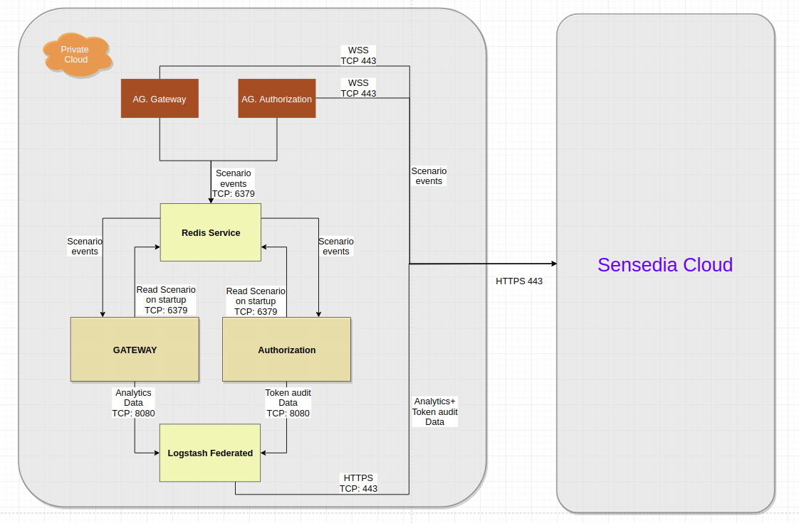

<!-- TOC -->

- [API-Platform Híbrido - Kubernetes](#api-platform-híbrido---kubernetes)
- [Módulos para Entorno Híbrido](#módulos-para-entorno-híbrido)
- [Modelos de Despliegue Soportados](#modelos-de-despliegue-soportados)
- [Topología Macro](#topología-macro)
- [Requisitos de Instalación](#requisitos-de-instalación)
  - [Creación de Customer ID](#creación-de-customer-id)
  - [Creación de Tokens](#creación-de-tokens)
  - [Redis](#redis)
    - [AWS ElastiCache](#aws-elasticache)
    - [GCP Memorystore](#gcp-memorystore)
    - [Instalación de Redis con Docker Compose](#instalación-de-redis-con-docker-compose)
  - [Instalación de Kubectl](#instalación-de-kubectl)
  - [Instalación del Helm](#instalación-del-helm)
    - [Descarga de Helm](#descarga-de-helm)
    - [Repositorio de Helm Charts de Sensedia](#repositorio-de-helm-charts-de-sensedia)
  - [Creación de Namespace en el Clúster Kubernetes](#creación-de-namespace-en-el-clúster-kubernetes)
- [Comandos Útiles](#comandos-útiles)
- [Instalación de los Módulos de la API-Platform](#instalación-de-los-módulos-de-la-api-platform)
  - [Cambio de la Versión de los Módulos y Otros Parámetros](#cambio-de-la-versión-de-los-módulos-y-otros-parámetros)
  - [Instalación de Agent Authorization](#instalación-de-agent-authorization)
  - [Instalación de Agent Gateway](#instalación-de-agent-gateway)
  - [Instalación de Logstash-Federated](#instalación-de-logstash-federated)
  - [Instalación de API-Authorization](#instalación-de-api-authorization)
  - [Instalación de API-Gateway](#instalación-de-api-gateway)
- [Activación del Entorno Híbrido](#activación-del-entorno-híbrido)

<!-- TOC -->

# API-Platform Híbrido - Kubernetes

Se recomienda el modelo de implementación híbrida para los clientes preocupados por la latencia. Esta documentación describe cómo implementar los módulos/servicios utilizados en el entorno híbrido usando [Kubernetes](https://kubernetes.io) y [Helm](https://helm.sh) .

El entorno híbrido consiste en módulos desarrollados por Sensedia y componentes de infraestructura.

Los componentes de la infraestructura, así como su funcionamiento y soporte, son responsabilidad del cliente. Por esto, tanto la infraestructura como el equipo competente deben ofrecer soluciones para:

* Ingress/egress
* Balance de carga
* Copia de seguridad
* Monitoreo

Cuadro 1: Servicios ejecutados/mantenidos por el Cliente en Entorno Híbrido.

| **Recurso** | **Opciones** | **Detalles** |
| --- | --- | --- |
| Ingress/Balance de Carga | Balance de carga HTTP/HTTPS (_ejemplo: ALB/F5/Nginx/Traefik, etc._). | Los certificados deben aplicarse a la capa de balanceo. |
| Copia de Seguridad | Cualquier solución que copia el archivo de retención de datos de Redis (_\*.rdb_) en un almacenamiento externo (_seguro_). | Este archivo debe protegerse mediante el contenido de información confidencial (_ejemplo: token de acceso_). |
| Monitoreo | Cualquier solución de monitoreo que admita la comprobación de estado HTTP. | Todos los módulos híbridos exponen métricas a través del endpoint ``/metrics``. La única excepción es la puerta de enlace (gateway), que expone métricas a través del endpoint ``gateway-admin/metrics``. |

# Módulos para Entorno Híbrido

Cuadro 2: Descripción de los requisitos de Ingress, Balance de Carga y Copia de Seguridad por módulo.

| **Módulo** | **Descripción** | **¿Se requiere Balance de carga?** | **¿Se requiere copia de seguridad?** |
| --- | --- | --- | --- |
| Agent-authorization | Transferencia de escenarios entre Cloud Sensedia y Authorization Híbrido. | No | No |
| Agent-gateway | Transferencia de escenarios entre Cloud Sensedia y Gateway Híbrido. | No | No
| Gateway | Responsable de procesamiento de mensajes. | Sí | No |
| Authorization | Responsable de generación de tokens. | Sí | No |
| Logstash-federated | Transferencia analítica de datos y auditoría de tokens a Cloud Sensedia. | Opcional | No |
| Redis | Red de memoria para compartir información entre módulos | No | Sí (normalmente \*.rdb) |

# Modelos de Despliegue Soportados

Cuadro 3: Opciones de aprovisionamiento por módulo.

| **Módulo** | **Kubernetes** | **Docker** | **VM (Centos/Red Hat 7)** | **Servicios Gestionados** |
| --- | --- | --- | --- | --- |
| Agent-authorization | Sí | Sí | Sí (sobre docker-compose) | n/a |
| Agent-gateway | Sí | Sí | Sí (sobre docker-compose) | n/a |
| Gateway | Sí | Sí | Sí (sobre docker-compose) | n/a |
| Authorization | Sí | Si | Sí (sobre docker-compose) | n/a |
| Logstash-federated | Sí | Sí | Sí (sobre docker-compose) | n/a |
| Redis (>= 4.0.11) | Libre elección ||| - ElastiCache (AWS) <br> \- Memorystore (GCP) |
| Ingress | Sí (service/ingress) | Sí (balanceador de carga del Cliente) | Sí (balanceador de carga del Cliente) | - ELB/ALB (AWS) <br> \- Compute Load Balancer (GCP) |

# Topología Macro

Figura 1: Representación de módulos y conexiones del Modelo Híbrido.



# Requisitos de Instalación

Las siguientes secciones presentan los requisitos para instalar la API-Platform en el entorno híbrido.

## Creación de Customer ID

El ``customerID`` es la identificación única de cada cliente y es generado por Sensedia.

Obtenga su ``customerID`` con el equipo de soporte. Esto será necesario para realizar ajustes en la configuración de parámetros del helm chart de algunos módulos de API-Platform.

Ejemplo de utilización de ``customerid`` en un archivo de configuración:

```
customerID: "CHANGE_HERE"
```

## Creación de Tokens

La configuración del entorno híbrido es un requisito previo para usar un token de la Plataforma. El token debe crearse mediante el siguiente procedimiento:

* Acceder al API Manager.
* Acceder a la página **Token de acceso** en el menú principal.
* Hacer clic en el botón **Create access token**.
* El campo **Owner** debe contener la dirección de correo electrónico de un usuario responsable del entorno.
* Establecer el valor de **API Platform Integration** en el campo **App** .


* En la página siguiente, seleccionar la API **API Manager 3.0.0**.


* Seleccionar el plan **Federated Plan**.


* Hacer clic en el botón **Save Plan**.
* En la página siguiente, publicar el token a través del botón **Publish your access token**.


* Guardar el token generado y almacenar en algún archivo, ya que lo necesitará para personalizar algunos parámetros de configuración para algunos módulos de la API-Platforma.

## Redis

Módulo responsable de almacenar los tokens de acceso y escenarios de API. La implementación de Redis Cluster se puede realizar a través de servicios gestionados, como AWS ElastiCache y GCP Memorystore. También se puede instalar Redis usando Docker Compose, según se muestra en esta [documentación](../compose/redis-cluster/README_es.md).

### AWS ElastiCache

La Plataforma de API admite ElastiCache (servicio gestionado de Redis en AWS). Este documento es solo una guía básica sobre la implementación con ElastiCache. Para obtener apoyo oficial, se recomienda leer la documentación oficial del servicio: https://aws.amazon.com/elasticache.

* Acceder a la consola de ElastiCache (https://console.aws.amazon.com/elasticache).
* Hacer clic en **Create** para iniciar el asistente **de Cache Cluster** .
* Seguir las instrucciones en la pantalla y configurar las preferencias de **VPC** y **Security Group** .
* Las opciones predeterminadas son suficientes para el uso de la API-Platform.
* El número de nodos varía en función de la carga de trabajo esperada para el entorno. A menos que exista una expectativa de alta carga de trabajo en el primer momento, recomendamos comenzar con 6 nodos en modo **Cluster**, supervisar y escalar según la demanda.

El resultado del proceso de instalación debe ser el **configuration endpoint** del ElastiCache, que se utilizará al ajustar los parámetros de configuración para algunos módulos de la API-Platform.

### GCP Memorystore

La API-Platform admite Memorystore (servicio gestionado de Redis en GCP). Este documento es solo una guía básica sobre la implementación con Memorystore. Para obtener apoyo oficial, se recomienda leer la documentación oficial del servicio: https://console.cloud.google.com/memorystore/instances.

* Crear un memorystore en modo **Cluster**.
* El número de nodos varía en función de la carga de trabajo esperada para el entorno.
* Las opciones predeterminadas son suficientes para el uso de la API-Platform.
* A menos que se espere una carga de trabajo elevada al principio, recomendamos iniciar con redundancia, supervisar y escalar según la demanda.

### Instalación de Redis con Docker Compose

Para facilitar la instalación, Sensedia proporciona documentación sobre la instalación de Redis en entornos locales utilizando Docker Compose. Sin embargo, se recomienda que la persona responsable de la instalación comprenda la tecnología y observe bien cada paso. Acceder a la documentación [aquí](../compose/redis-cluster/README_es.md).

## Instalación de Kubectl

Kubectl es una herramienta de línea de comandos utilizada para administrar clústeres Kubernetes.

Ejecute los siguientes comandos para instalar ``kubectl`` en GNU/Linux.

```bash
curl -LO https://storage.googleapis.com/kubernetes-release/release/$(curl -s https://storage.googleapis.com/kubernetes-release/release/stable.txt)/bin/linux/amd64/kubectl

chmod +x kubectl

sudo mv kubectl /usr/local/bin/kubectl

kubectl version --client
```

Más información sobre kubectl en: https://kubernetes.io/docs/reference/kubectl/overview/.


## Instalación del Helm

La instalación de la Plataforma de API se realiza a través de paquetes del Helm, también conocidos como **Helm charts** o simplemente **charts** .

Helm es el administrador de paquetes Kubernetes. Al igual que un administrador de paquetes del sistema operativo facilita la instalación de aplicaciones y herramientas, Helm ayuda a instalar aplicaciones y recursos en clústeres de Kubernetes.

### Descarga de Helm

Ejecutar los siguientes comandos para instalar **Helm 3** en GNU/Linux.

```bash
wget https://get.helm.sh/helm-v3.2.4-linux-amd64.tar.gz

tar -zxvf helm-v3.2.4-linux-amd64.tar.gz

sudo cp linux-amd64/helm /usr/bin/

sudo chmod +x /usr/bin/helm

helm version
```

Para que el siguiente comando funcione correctamente, ``kubectl`` debe estar configurado y conectado a un clúster de Kubernetes.

```bash
helm ls
```

### Repositorio de Helm Charts de Sensedia

Adicionar el repositorio de Helm charts estables de Sensedia disponible en AWS-S3.

```bash
helm repo add sensedia-helm-s3 http://sensedia-helm-charts-s3.s3.amazonaws.com
```

Actualizar la lista de charts disponibles para instalación.

```bash
helm repo update
```

Listar todas las versiones de Helm charts disponibles para instalación. El nombre del chart está en la columna **NAME** y la versión está en la columna **CHART\_VERSION** . La información contenida en la columna **APP VERSION** se puede ignorar, ya que optamos por no indexar la versión de cada módulo de la API-Platform en esa columna e indexar sólo en la imagen Docker en el archivo ``*.yaml``de cada chart.

```bash
helm search repo sensedia-helm-s3 -l
```

Inicialmente, las versiones de charts utilizadas en este documento se citan a continuación. Pero con la evolución del producto a lo largo del tiempo, nuevas versiones de gráficos estarán disponibles y recomendamos utilizar las más recientes. Para cualquier pregunta, póngase en contacto con el equipo de soporte de Sensedia.

* agent-authorization - 1.0.1 o superior
* agent-gateway - 1.0.1 o superior
* logstash-federated - 1.0.2 o superior
* api-authorization - 1.0.0 o superior
* api-gateway - 1.0.3 o superior

## Creación de Namespace en el Clúster Kubernetes

Se recomienda instalar los módulos de la Plataforma en un namespace específico para separar los recursos de la API-Platform del resto de las aplicaciones del clúster.

Utilizar los siguientes comandos para crear un namespace y listar los namespaces creados en el clúster Kubernetes.

> NOTA: Para que los siguientes comandos funcionen correctamente, kubectl debe estar configurado y conectado a un clúster de Kubernetes. También se puede sustituir el término ``MY_HYBRID_ENV`` por otro nombre de namespace y utilizarlo en todos los comandos a lo largo de esta documentación.

```bash
kubectl create namespace MY_HYBRID_ENV

kubectl get namespaces
```

Ejemplos de nombres de namespace:

* datacenter-sp1-gateways
* datacenter-sp2-gateways
* datacenter-rj1-gateways

# Comandos Útiles

Durante la instalación de los módulos de la Plataforma, es posible listar los objetos creados, así como sus respectivos registros, utilizando los siguientes comandos.

Ejecutar este comando para enumerar el ``id`` de cada pod en un namespace:

```bash
kubectl get pods -n MY_HYBRID_ENV
```

Ejecutar el siguiente comando para ver el registro de un pod de un namespace.

```bash
kubectl logs -f POD_ID -n MY_HYBRID_ENV
```

# Instalación de los Módulos de la API-Platform

Las siguientes secciones proporcionan información sobre la instalación de módulos de la API-Platform para entornos híbridos.

## Cambio de la Versión de los Módulos y Otros Parámetros

> Nota: Utilizar las explicaciones de esta sección y el ejemplo como base para cambiar la versión de uno o más módulos de la Plataforma y personalizar los demás parámetros según sea necesario para cada entorno.

A medida que el desarrollo de la Plataforma evoluciona y de acuerdo con las necesidades del entorno híbrido de cada cliente, puede ser necesario personalizar algunos parámetros antes de la implementación.

Cada archivo en formato .yaml que se crea en las siguientes secciones contendrá un conjunto de opciones que se pueden personalizar.

A continuación se presenta el ejemplo de un archivo .yaml para implementar un módulo y se explica qué valores se pueden personalizar.

Ejemplo 1: Contenido del archivo ``values.yaml`` del módulo **Agent Authorization**.

```yaml
1 replicaCount: 1
2
3 image:
4   repository: gcr.io/production-main-268117/agent-authorization
5   tag: 1909.1.1.2
6   pullPolicy: IfNotPresent
7
8 service:
9   type: ClusterIP
10   port: 80
11
12 properties:
13   javaOpts: "-Djava.security.egd=file:/dev/./urandom -Dfile.encoding=UTF8 -Xms1536m -Xmx1536m -XX:ParallelGCThreads=1 -XX:ConcGCThreads=1 -Djava.util.concurrent.ForkJoinPool.common.parallelism=1 -XX:CICompilerCount=2 -XX:+UseParallelGC -XX:GCTimeRatio=4 -XX:AdaptiveSizePolicyWeight=90 -XX:MinHeapFreeRatio=20 -XX:MaxHeapFreeRatio=40 -XX:+ExitOnOutOfMemoryError"
14   redis:
15     connectionType: "CHANGE_HERE" #Up to you. Are you using CLUSTER or MASTER_SLAVE?
16     address: "CHANGE_HERE" #Example: x.x.x.x:6379
17   logLevel: INFO
18   trackExpires: 7
19   websocketUri: wss://integration-aws.sensedia.com/websocket
20   customerId: "CHANGE_HERE"
21   sensediaAuth: "CHANGE_HERE"
22
23 autoscaling:
24   enabled: false
25   minReplicas: 1
26   maxReplicas: 1
27   averageUtilization: 70
28
29 ingress:
30   enabled: false
31   annotations: {}
32   hosts:
33     - host: chart-example.local
34       paths: []
35   tls: []
36
37 resources:
38   limits:
39     cpu: "1"
40     memory: 1Gi
41   requests:
42     cpu: 600m
43     memory: 640Mi
```                            

Cambiar los valores que contienen``CHANGE_HERE`` a valores consistentes con su entorno híbrido.

Explicación del contenido del archivo ``values.yaml`` del módulo **Agent Authorization** .

* La **línea 1** define el número de réplicas del pod, que ejecuta el módulo y se puede ejecutar en el clúster de Kubernetes. Cambiar el valor según la demanda y disponibilidad de recursos de CPU, memoria y direcciones IP.
* La **línea 4** contiene la dirección del Docker Registry y el nombre de la imagen Docker del módulo respectivo (``gcr.io/production-main-268117/agent-authorization`` ). Debe ponerse en contacto con el equipo de Sensedia para averiguar la URL del Docker Registry, el nombre de la imagen docker del módulo que debe usar y cambiar en el ``archivo.yaml`` antes del despliegue.
* La **línea 5** contiene la versión del módulo (``1909.1.1.2`` ). Debe ponerse en contacto con el equipo de Sensedia para averiguar qué versión usar y cambiar en el archivo ``.yaml`` antes del despliegue.
* Las **líneas 23 a 27** contienen la definición de autoscaling para el pod. Cambiar según la demanda y disponibilidad de los recursos de hardware en el clúster y las direcciones IP.
* Las **líneas 29 a 35** contienen la definición de ingress y TLS para el módulo. Cambiar según la necesidad del entorno.
* Las **líneas 37 a 43** contienen la definición de los límites de uso de los recursos de CPU y memoria que utilizará cada pod del módulo. Cambiar según la demanda y disponibilidad de los recursos de hardware en el clúster.

## Instalación de Agent Authorization

El archivo que contiene parámetros de configuración de ejemplo para el módulo **Agent Authorization** está disponible [aquí](helm/values_examples/agent-authorization/values.yaml) .

Acceder a su directorio ``/home`` y crear el directorio ``api-platform-hybrid``.

```bash
cd ~

mkdir api-platform-hybrid
```

Crear una copia del ``values.yaml`` de ejemplo en el archivo ``api-platform-hybrid/agent-authorization.yaml``.

```bash
cp api-platform-hybrid/kubernetes/helm/values_examples/agent-authorization/values.yaml ~/api-platform-hybrid/agent-authorization.yaml
```

Cambiar los valores de los parámetros del archivo ``api-platform-hybrid/agent-authorization.yaml`` según las instrucciones de la sección **Cambio de la Versión de los Módulos y Otros Parámetros**.

Utilizar el siguiente comando para el despliegue de **Agent Authorization**.

> NOTA: Cambiar el término ``VERSION`` por el número de versión del Helm chart, como se muestra en la sección **Repositorio de Helm Charts de Sensedia**.

```bash
helm upgrade --install agent-authorization sensedia-helm-s3/agent-authorization --version VERSION --namespace MY_HYBRID_ENV --values api-platform-hybrid/agent-authorization.yaml
```

## Instalación de Agent Gateway

El archivo que contiene parámetros de configuración de ejemplo para el módulo **Agent Gateway** está disponible [aquí](helm/values_examples/agent-gateway/values.yaml) .

Crear una copia del ``values.yaml`` de ejemplo en el archivo ``api-platform-hybrid/agent-gateway.yaml``.

```bash
cp api-platform-hybrid/kubernetes/helm/values_examples/agent-gateway/values.yaml ~/api-platform-hybrid/agent-gateway.yaml
```

Cambiar los valores de los parámetros del archivo ``api-platform-hybrid/agent-gateway.yaml`` según las instrucciones de la sección **Cambio de la Versión de los Módulos y Otros Parámetros**.

Utilizar el siguiente comando para el despliegue de **Agent Gateway**.

> NOTA: Cambiar el término ``VERSION`` por el número de versión del Helm chart, como se muestra en la sección **Repositorio de Helm Charts de Sensedia**.

```bash
helm upgrade --install agent-gateway sensedia-helm-s3/agent-gateway --version VERSION --namespace MY_HYBRID_ENV --values api-platform-hybrid/agent-gateway.yaml
```

## Instalación de Logstash-Federated

El archivo que contiene parámetros de configuración de ejemplo para el módulo **Logstash-Federated** está disponible [aquí](helm/values_examples/logstash-federated/values.yaml) .

Crear una copia del ``values.yaml`` de ejemplo en el archivo ``api-platform-hybrid/logstash-federated.yaml``.

```bash
cp api-platform-hybrid/kubernetes/helm/values_examples/logstash-federated/values.yaml ~/api-platform-hybrid/logstash-federated.yaml
```

Cambiar los valores de los parámetros del archivo ``api-platform-hybrid/logstash-federated.yaml`` según las instrucciones de la sección **Cambio de la Versión de los Módulos y Otros Parámetros**.

Utilizar el siguiente comando para el despliegue de **Logstash-Federated**.

> NOTA: Cambiar el término ``VERSION`` por el número de versión del Helm chart, como se muestra en la sección **Repositorio de Helm Charts de Sensedia**.

```bash
helm upgrade --install logstash-federated sensedia-helm-s3/logstash-federated --version VERSION --namespace MY_HYBRID_ENV --values api-platform-hybrid/logstash-federated.yaml.yaml
```

## Instalación de API-Authorization

El archivo que contiene parámetros de configuración de ejemplo para el módulo **API Authorization** está disponible [aquí](helm/values_examples/api-authorization/values.yaml) .

Crear una copia del ``values.yaml`` de ejemplo en el archivo ``api-platform-hybrid/api-authorization.yaml``.

```bash
cp api-platform-hybrid/kubernetes/helm/values_examples/api-authorization/values.yaml ~/api-platform-hybrid/api-authorization.yaml
```

Cambiar los valores de los parámetros del archivo ``api-platform-hybrid/api-authorization.yaml`` según las instrucciones de la sección **Cambio de la Versión de los Módulos y Otros Parámetros**.

Utilizar el siguiente comando para el despliegue de **API Authorization**.

> NOTA: Cambiar el término ``VERSION`` por el número de versión del Helm chart, como se muestra en la sección **Repositorio de Helm Charts de Sensedia**.

```bash
helm upgrade --install api-authorization sensedia-helm-s3/api-authorization --version VERSION --namespace MY_HYBRID_ENV --values api-platform-hybrid/api-authorization.yaml
```

## Instalación de API-Gateway

El archivo que contiene parámetros de configuración de ejemplo para el módulo **API-Gateway** está disponible [aquí](helm/values_examples/api-gateway/values.yaml) .

Crear una copia del ``values.yaml`` de ejemplo en el archivo ``api-platform-hybrid/api-gateway.yaml``.

```bash
cp api-platform-hybrid/kubernetes/helm/values_examples/api-authorization/values.yaml ~/api-platform-hybrid/api-authorization.yaml
```

Cambiar los valores de los parámetros del archivo ``api-platform-hybrid/api-gateway.yaml`` según las instrucciones de la sección **Cambio de la Versión de los Módulos y Otros Parámetros**.

Utilizar el siguiente comando para el despliegue de **API Gateway**.

> NOTA: Cambiar el término ``VERSION`` por el número de versión del Helm chart, como se muestra en la sección **Repositorio de Helm Charts de Sensedia**.

```bash
helm upgrade --install api-gateway sensedia-helm-s3/api-gateway --version VERSION --namespace MY_HYBRID_ENV --values api-platform-hybrid/api-gateway.yaml
```

Listar los pods de su namespace para comprobar que todos los módulos están instalados.

```bash
kubectl get pods -n MY_HYBRID_ENV
```

# Activación del Entorno Híbrido

La instalación del entorno se basa en grupos de puertas de enlace (gateway pools). Estos pools representan un grupo de puertas de enlace que pueden utilizar uno o más entornos virtuales.

> NOTA: Solo la creación del grupo de puertas de enlace es realizada por el equipo de **Soporte y Operaciones** de Sensedia a través de la apertura de un llamado.

* Para activar un entorno híbrido, acceder al **API Manager** y hacer clic en el menú **Environments**.
* Crear un nuevo **Environment** y rellenar los campos:
  * Name;
  * Inbound URL;
  * Description;
  * Gateway Pool (en este campo, incluir el gateway pool informado por el equipo de Sensedia a través de su llamado de suporte).
* Hacer clic en **Add Map**.


  * Crear un Map para establecer la variable **Destination de Authorization**, el valor será el endpoint de la **Authorization** creada durante la instalación de módulos híbridos de la API-Platform.  


* Acceder al menú **APIs**.
* Seleccionar/Crear la API que desea ser utilizada por este grupo de puertas de enlace;
* Agregar el **Entorno Federado a** la API seleccionada/creada;
* Desplegar el **Entorno Federado**.


* Para validar su API, realizar una petición a la puerta de enlace híbrida.

