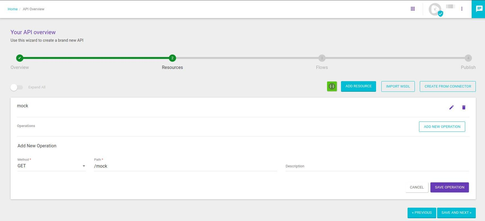
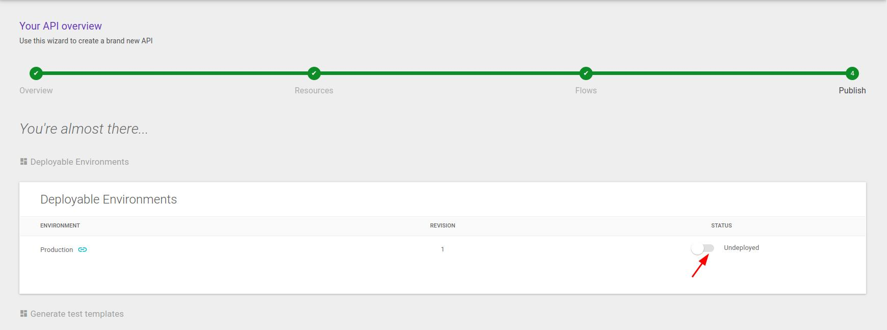

<!-- TOC -->

# Validation of the federated flow

To perform the flow validation, we use a simple API with a mock interceptor and logs for analysis if necessary.
For this, it is necessary to have completed all provisioning and configuration of the federated environment.
* Access API Design > API Catalog
* Click on the **+** to create a new API.


*  Fill in the fields as per the example:
   * API Name
   * API version 
   * Base path
   * Select the federated Environment 
   * Click on **SAVE AND NEXT**
 


*  Add a Resource:


*  Fill in the fields as per the example:
   * Resource name
   * Click on **SAVE** 




*  Fill in the fields as per the example:
   * Choose the GET method
   * Define the Path
   * Click on **SAVE OPERATION** 
   * Click on **SAVE AND NEXT**


*  Fill in the fields as per the example:
   * Select the created Resource and the GET operation
   * Add a Mock Interceptor


*  Fill in the fields as per the example:
   * Add the example below in the body
   * Set the status to **200** 

```bash
{
    "firstName": "Paulo",
    "lastName": "Silva",
    "age": 25,
    "address":
    {
        "streetAddress": "Avenida das Palmeiras",
        "city": "São Paulo",
        "state": "SP",
        "postalCode": "1024"
    },
    "phoneNumber":
    [
        {
          "type": "Fixo",
          "number": "11 0000-1111"
        },
        {
          "type": "Celular",
          "number": "11 1.1111-0000"
        }
    ]
}
```

* Access the **Tracing** intercepts tab 
   * Add two Log interceptors, one before and one after the Mock
   * Click on **SAVE AND NEXT**
     


* Deploy the API.
  


* Go to API Design > API Catalog
   * Open the created API
   * In Environments, click on the icon as per the arrow and copy the value
   * Check the value of the Path
     


* To perform the validation, access a terminal or request tool and execute a curl command as per the example. 

```bash
curl -X GET https://api-support-aws.sensedia.com/mock-hybrid/mock
```


