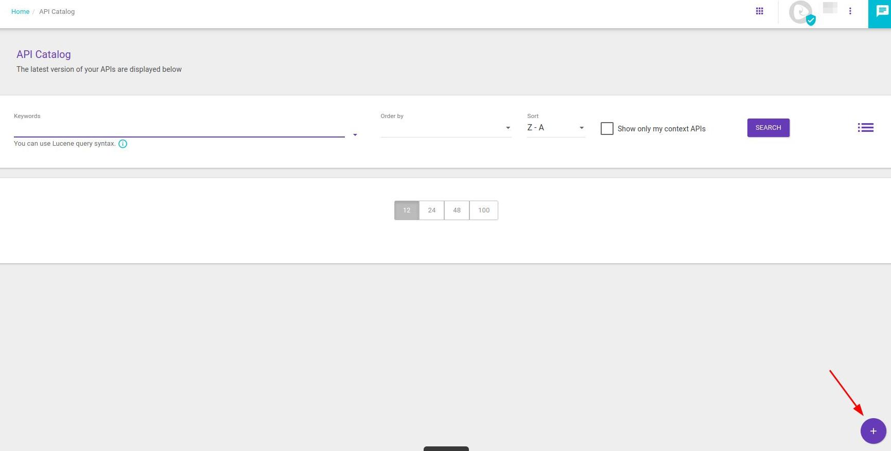
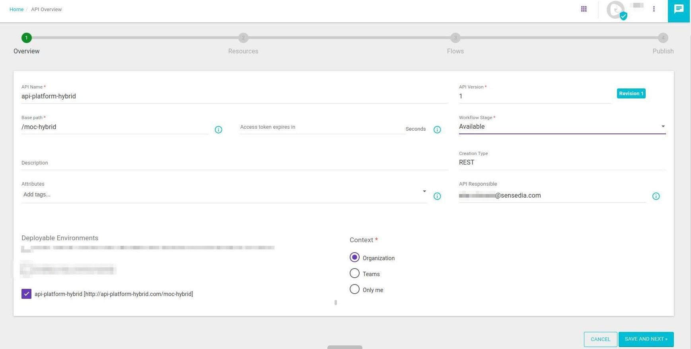
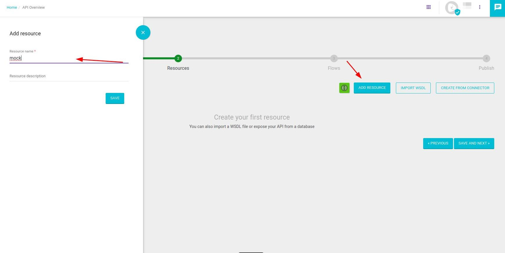
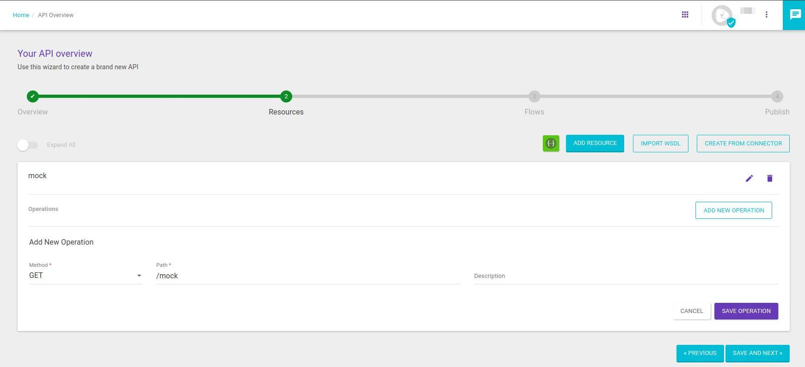
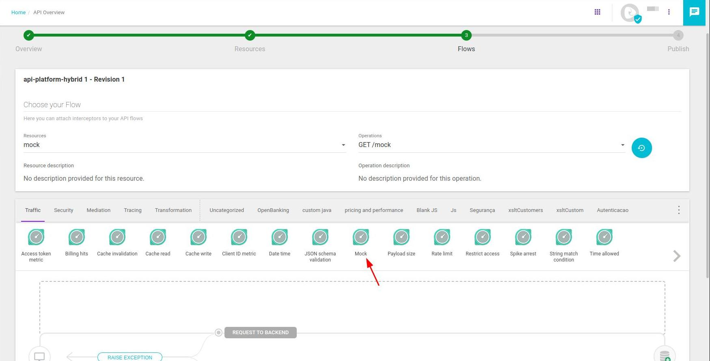
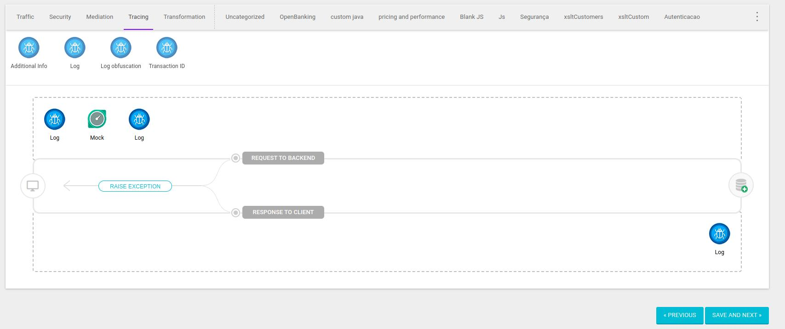
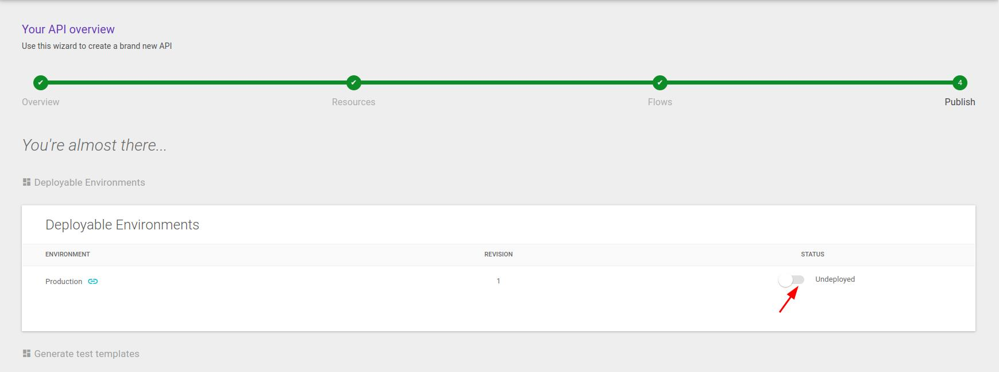
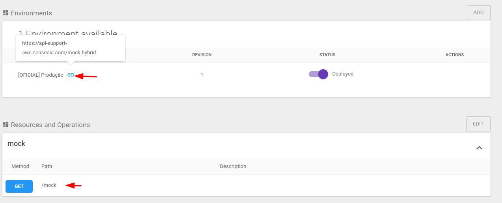
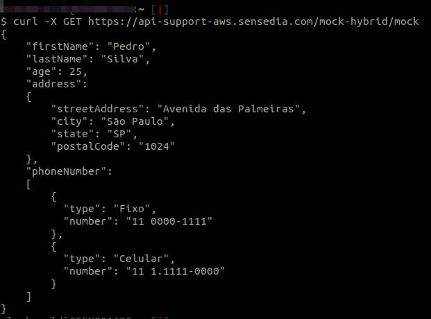

<!-- TOC -->

# Validación del flujo federado
Para realizar la validación del flujo utilizamos una API simple con un interceptor de mock y logs para, en caso necesario, realizar un análisis.
Para ello, es necesario haber concluido todo el aprovisionamiento y configuración del Enviroment federado.


* Acceder al menú API Design > API Catalog
* Hacer clic en **+**  para crear una nueva API



*  Complete los campos según el ejemplo:
   * API Name
   * Api version 
   * Base path
   * Seleccione el Enviroment federado
   * Hacer clic en **SAVE AND NEXT**
 


*  Añadir un Resource:



*  Preencha os campos conforme exemplo:
   * Resource name
   * Hacer clic en **SAVE** 




*  Complete los campos según el ejemplo:
   * Elige el método GET
   * Establecer el Path
   * Hacer clic en **SAVE OPERATION** 
   * Hacer clic en **SAVE AND NEXT**





*  Complete los campos según el ejemplo:
   *  Seleccione el Resource creado y la opción GET
   *  Agregar un interceptor de mock


*  Complete los campos según el ejemplo:
   * Agregar en body osegún el ejemplo
   * Establecer el estado **200** 

```bash
{
    "firstName": "Paulo",
    "lastName": "Silva",
    "age": 25,
    "address":
    {
        "streetAddress": "Avenida das Palmeiras",
        "city": "São Paulo",
        "state": "SP",
        "postalCode": "1024"
    },
    "phoneNumber":
    [
        {
          "type": "Fixo",
          "number": "11 0000-1111"
        },
        {
          "type": "Celular",
          "number": "11 1.1111-0000"
        }
    ]
}
```

* Acceder a la pestaña de intercepciones **Tracing**
   * Agregue dos interceptores de Log, uno antes y otro después del Mock.
   * Hacer clic en **SAVE AND NEXT**
     



* Realizar el Deploy de la API
  


* Acceder al menú API Design > API Catalog
   * Abrir la API creada
   * En Environments Hacer clic en Icone según la flecha y copie el valor
   * Verifique el valor del Path
     


* Para realizar la validación, acceda a una terminal o solicite una herramienta 
y ejecutar un **curl** como en el ejemplo


```bash
curl -X GET https://api-support-aws.sensedia.com/mock-hybrid/mock
```




