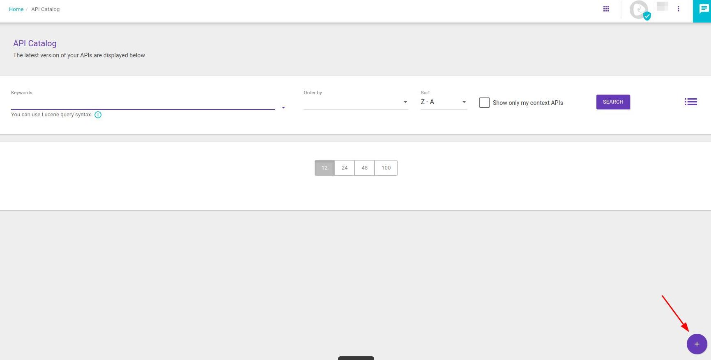
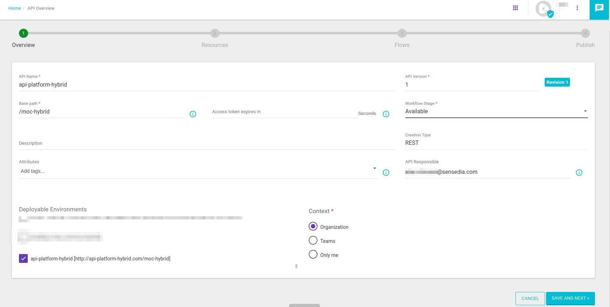
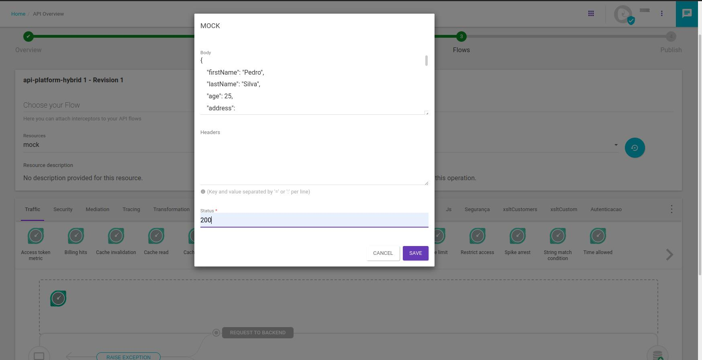
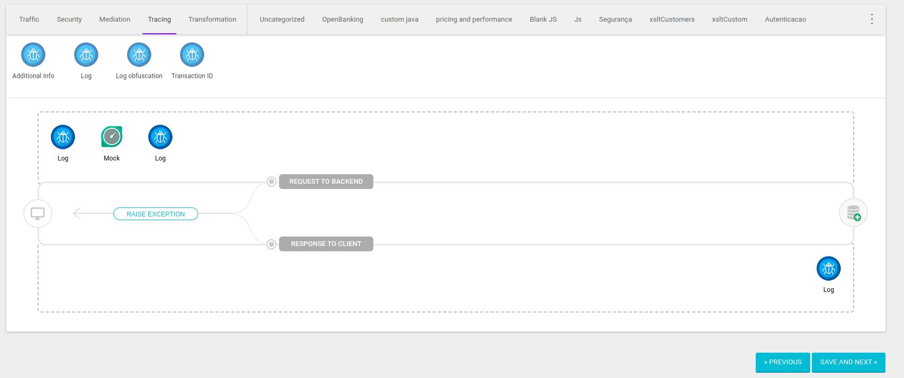
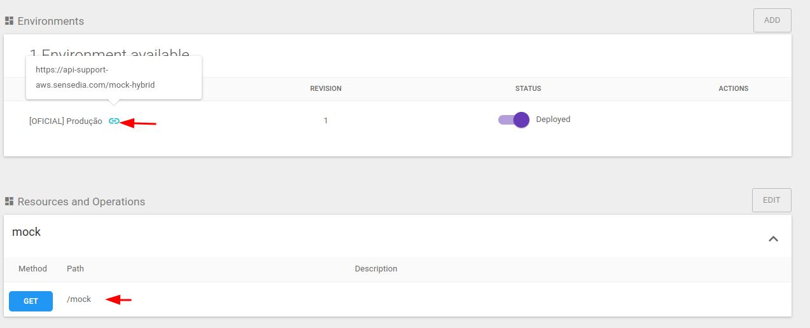
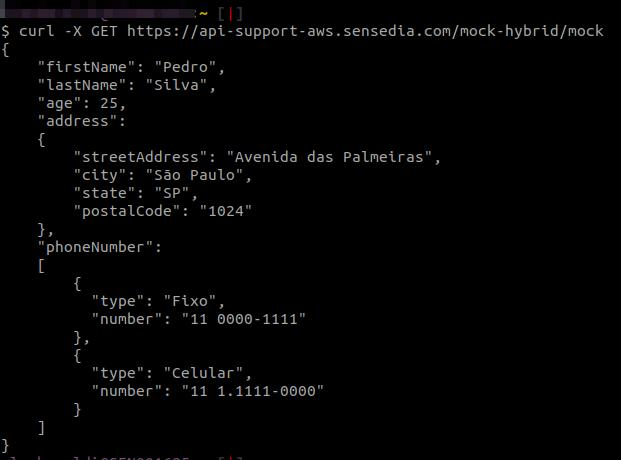

<!-- TOC -->

# Validação do fluxo federado

Para realizar a validação do fluxo utilizamos uma api simples com um interceptor de mock e logs para caso necessário realizarmos uma análise.

Para isso é necessário ter concluído todo provisionamento e configuração do enviroment federado

* Acesse API Design > API Catalog
* Clique no **+**  para criar uma nova API



*  Preencha os campos conforme exemplo:
   * API Name
   * Api version 
   * Base path
   * Selecione o Enviroment federado 
   * Clique em **SAVE AND NEXT**
 


*  Adicione um Resource:


*  Preencha os campos conforme exemplo:
   * Resource name
   * Clique em **SAVE** 


*  Preencha os campos conforme exemplo:
   * Escolha o metodo GET
   * Defina o Path
   * Clique em **SAVE OPERATION** 
   * Clique em **SAVE AND NEXT**


*  Preencha os campos conforme exemplo:
   * Selecione o Resource criado e a opreção GET
   * Adicione um Interceptor de moc 




*  Preencha os campos conforme exemplo:
   * Adicione em body o exemplo abaixo
   * Defina o status como **200** 

```bash
{
    "firstName": "Paulo",
    "lastName": "Silva",
    "age": 25,
    "address":
    {
        "streetAddress": "Avenida das Palmeiras",
        "city": "São Paulo",
        "state": "SP",
        "postalCode": "1024"
    },
    "phoneNumber":
    [
        {
          "type": "Fixo",
          "number": "11 0000-1111"
        },
        {
          "type": "Celular",
          "number": "11 1.1111-0000"
        }
    ]
}
```


* Acesse a aba de interceptos de **Tracing**
   * Adicione dois interceptors de Log sendo um antes e um depois do Mock
   * Clique em **SAVE AND NEXT**


* Realize o Deploy da API




* Acesse API Design > API Catalog
   * Abra a api criada
   * Em Environments clique no Icone conforme a seta e copie o valor
   * Verifique o valor do Path




* Para realizar a validação, acesse um terminal ou ferramenta de requisição 
e execute um curl conforme exemplo 

```bash
curl -X GET https://api-support-aws.sensedia.com/mock-hybrid/mock
```


